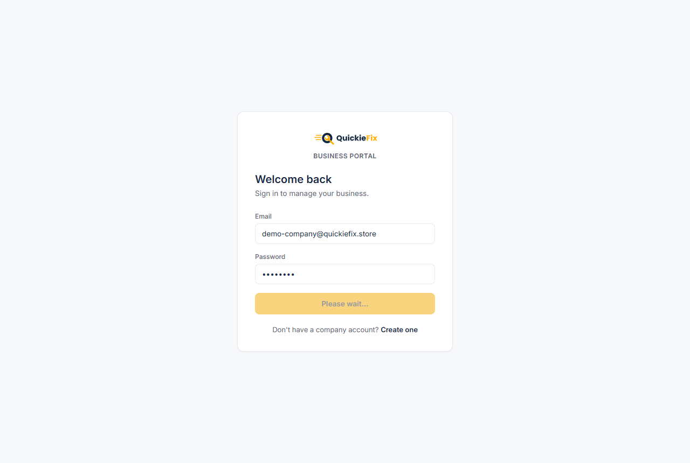
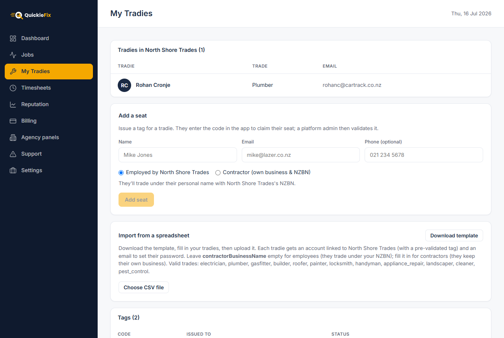
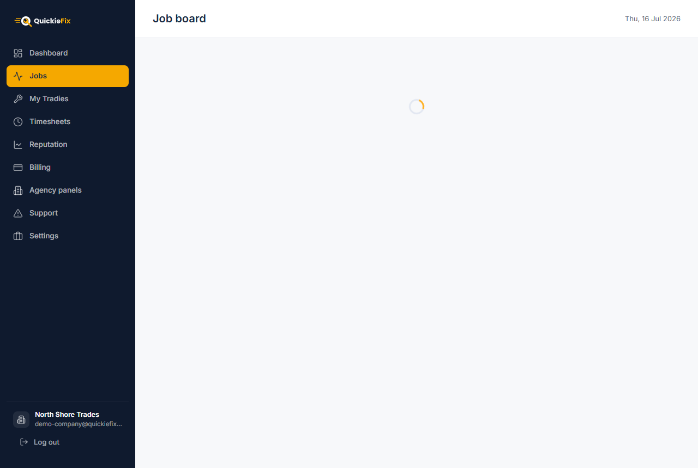
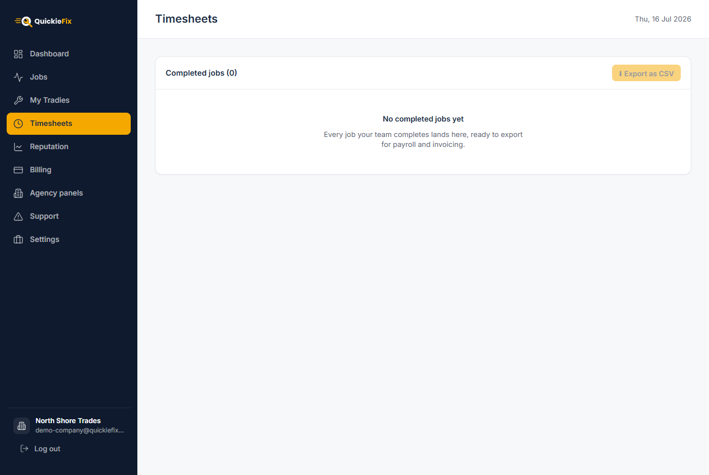
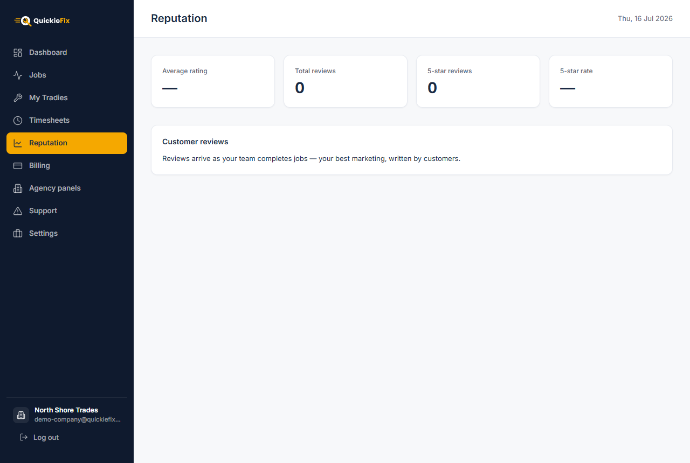
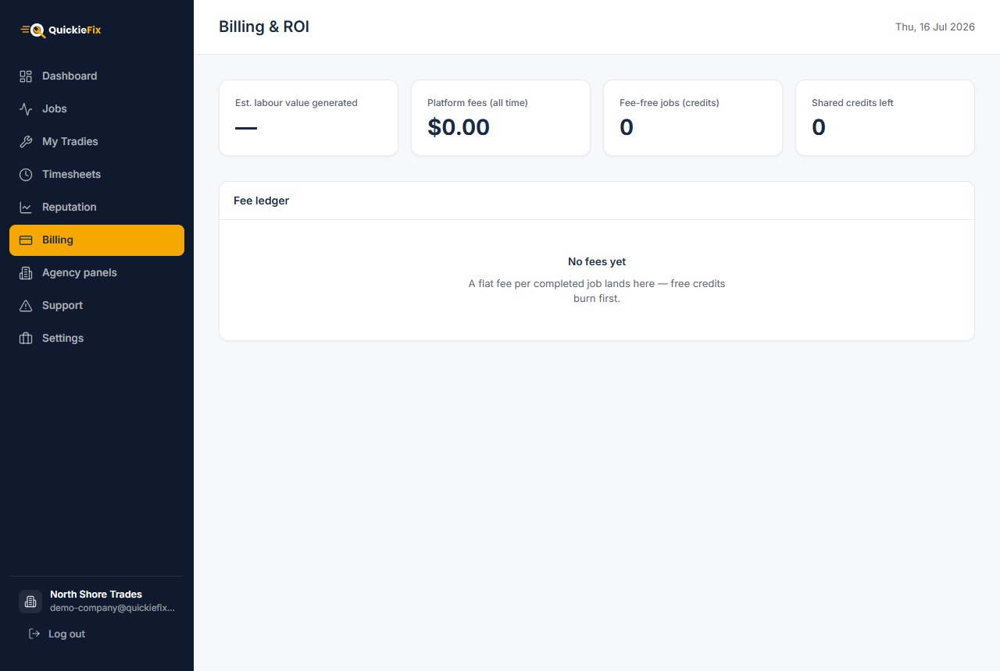
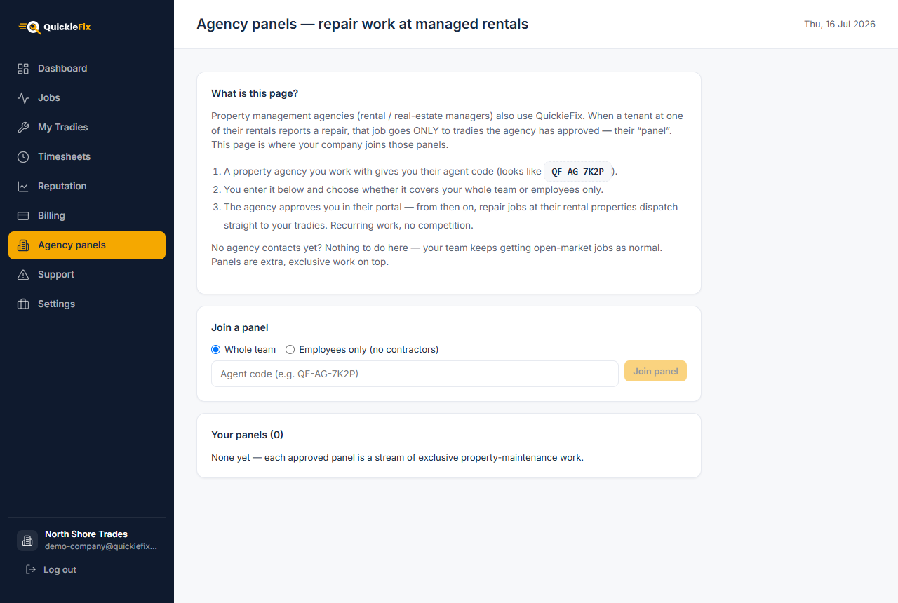
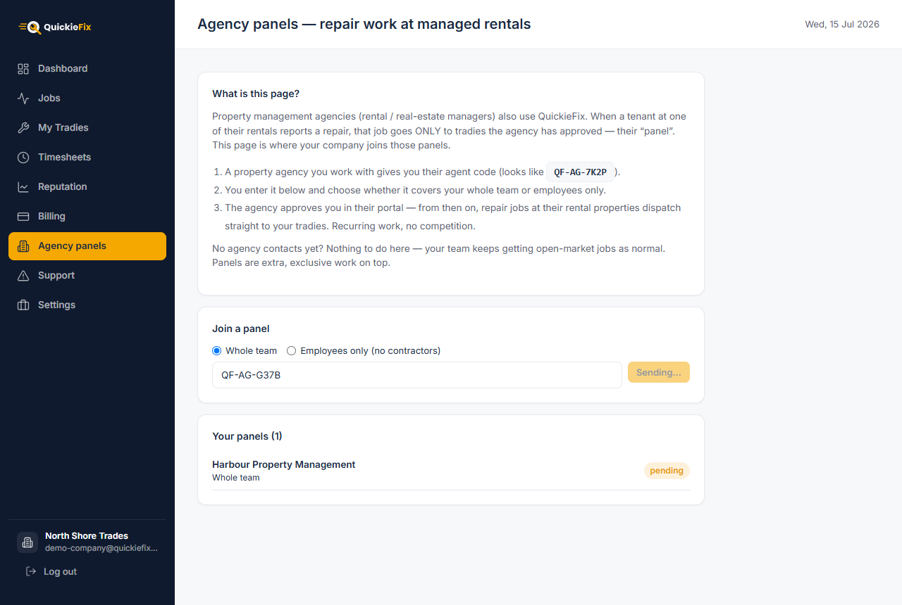
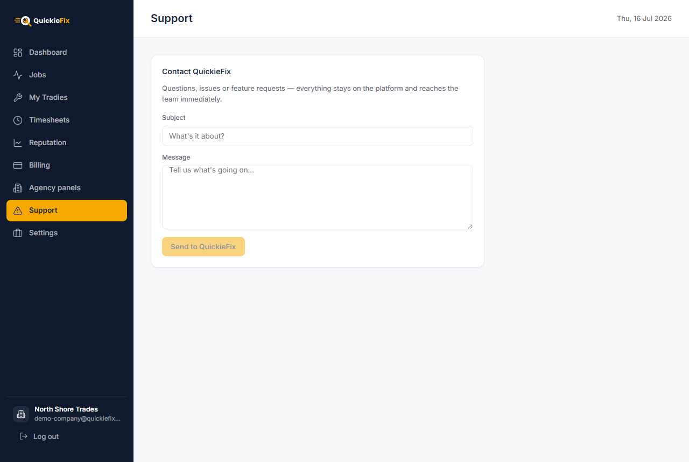
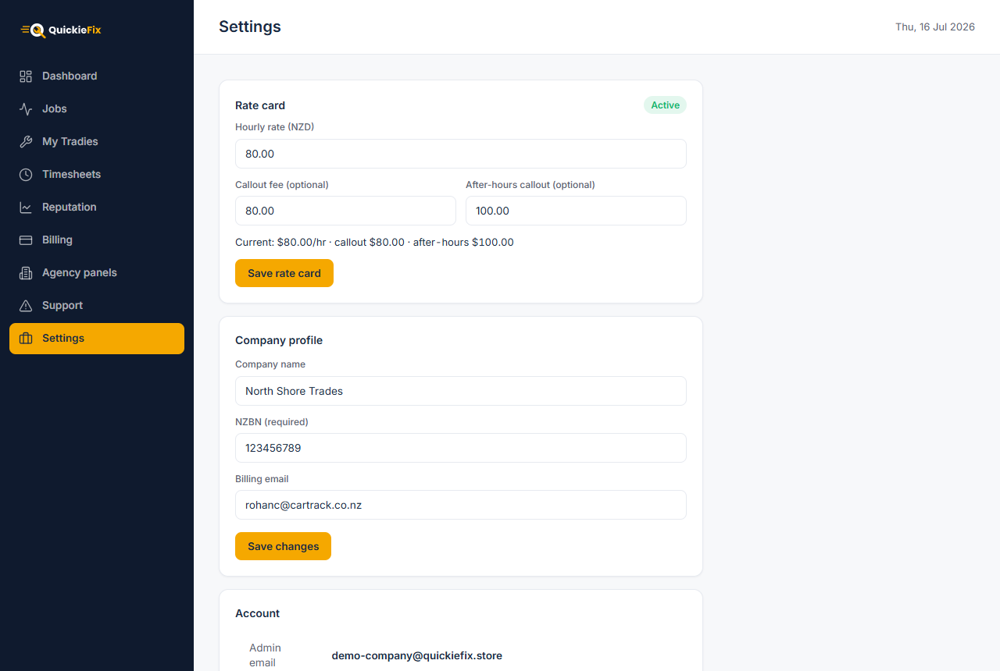

# QuickieFix Company Manual

| | |
|---|---|
| **Version** | 2.0 |
| **Date** | 15 July 2026 |
| **Audience** | Trade company owners & admins |
| **Portal** | portal.quickiefix.app |

---

## Contents

1. [What the business portal does](#1-what-the-business-portal-does)
2. [Creating your company account](#2-creating-your-company-account)
3. [Dashboard & going live](#3-dashboard--going-live)
4. [Building your team — My Tradies](#4-building-your-team--my-tradies)
5. [Jobs board](#5-jobs-board)
6. [Timesheets](#6-timesheets)
7. [Reputation](#7-reputation)
8. [Billing & ROI](#8-billing--roi)
9. [Agency panels — the growth engine](#9-agency-panels--the-growth-engine)
10. [Support](#10-support)
11. [Settings](#11-settings)
12. [FAQ](#12-faq)

---

## 1. What the business portal does

The QuickieFix Business Portal at **portal.quickiefix.app** is mission control for a trade company running a team of tradies on QuickieFix. Your tradies work from the mobile app; you run the business from the portal:

| Area | What you get |
|---|---|
| **My Tradies** | Build and manage your roster — add seats one at a time or import a whole spreadsheet |
| **Dashboard** | Live KPIs and a per-tradie performance table |
| **Jobs** | A live board of every job your team is on, as it happens |
| **Timesheets** | Every completed job with on-site and total minutes, exportable as CSV for payroll and invoicing |
| **Reputation** | All customer reviews across the team in one place, ready to share |
| **Billing & ROI** | Estimated labour value earned vs. the flat platform fees you pay |
| **Agency panels** | Join property-agency maintenance panels for recurring, exclusive repair work |
| **Settings** | Rate card, company profile (name, NZBN, billing email) |

How dispatch works: your tradies simply go **Available** in the app. QuickieFix routes company-sourced work to your team, every job they accept is stamped with your company name and rate card, and the results stream into your portal in real time — no refreshing, no manual reporting.

> 💡 **Pricing in one line:** QuickieFix charges a flat **NZ$15 per completed job** — never a percentage. Each tradie's **first 5 jobs are free**, and fees for company-sourced jobs are billed to the company, not the tradie.

---

## 2. Creating your company account

You need one thing before you start: your **NZBN** (New Zealand Business Number). It is required — employees on your roster trade under your NZBN, so QuickieFix will not create a trade company without one.

1. Open **portal.quickiefix.app**.
2. Click **Create one** under the sign-in form.
3. Choose **🧰 Trade company** (not Property agency).
4. Fill in:

   | Field | Notes |
   |---|---|
   | **Company name** | e.g. *Your Business Ltd* — customers see this on every job |
   | **NZBN (required)** | Your 13-digit New Zealand Business Number (starts 9429…) |
   | **Your name** | The admin's name |
   | **Email** | Becomes your admin login |
   | **Password** | Minimum 6 characters |

5. Click **Create company**. You land straight on your Dashboard.

*Sign in or create your trade company at portal.quickiefix.app.*

To sign back in later, use **Sign in** at the same URL with your admin email and password.

> ⚠️ **Why the NZBN is mandatory:** tradies you engage as *employees* appear to customers under their personal name trading with **your** NZBN. Without an NZBN on file there is no legal number for them to trade under, so set it before confirming any employee seats.

---

## 3. Dashboard & going live

### The setup checklist

A brand-new company sees a **"Get your team live"** checklist instead of four dead-zero KPIs. It tracks four steps:

1. **Create company account** — already done. ✓
2. **Add your first tradie** — invite pros so jobs can be routed to your team (issuing a seat counts; you don't wait on validation).
3. **Set your rate card** — required to go live; customers see these rates.
4. **Land your first job** — your tradies just go Available in the app; dispatch does the rest.

Each step has a button that takes you to the right page. The checklist disappears once you are set up (tradies added + rate card saved) — the real dashboard shows even before your first job completes.

*The Dashboard: KPI band on top, team performance table below.*

### The KPI band

Once you're live, the top band shows four numbers, updated live:

| KPI | Meaning |
|---|---|
| **Tradies** | Validated tradies on your roster |
| **Completed jobs** | Total jobs completed across the team |
| **Avg rating** | Average customer star rating across rated tradies |
| **Time on site** | Total billable on-site time across all completed jobs |

### Team performance table

Below the band, every tradie gets a row: **name & business name, trade, jobs completed, star rating, time on site, and approval status** (Approved / pending). The table is sorted by completed jobs, so your top performer is always on top. Click any row to open that tradie's detail page.

> 💡 Everything on the dashboard is a **live listener** — a job completing, a seat being removed, a tradie being confirmed all appear instantly without a refresh.

---

## 4. Building your team — My Tradies

**My Tradies** is the core workflow of the portal. It has three parts: the roster of validated tradies, the **Add a seat** form, and the **spreadsheet import**. Below them, the **Tags** table tracks every seat you've ever issued.

*My Tradies: your roster on top, Add a seat and spreadsheet import below.*

### 4.1 Add a seat (one tradie at a time)

1. Enter the tradie's **Name** and **Email** (**Phone** is optional).
2. Pick the **engagement** — this tick is the single most important decision on the page:

   | Option | What it means |
   |---|---|
   | **Employed by \<your company\>** | They trade under their **personal name** with **your company's NZBN**. Their own business identity is stored and automatically restored if they ever leave. |
   | **Contractor (own business & NZBN)** | They keep their **own business name and NZBN**, and invoice you for their work. |

3. Click **Add seat**.

> ⚠️ **The company's tick is authoritative.** You declare the engagement when you issue the seat — it decides whose NZBN and business name the tradie works under. Get it right before you confirm them.

### 4.2 Seat codes: issue → claim → confirm

Adding a seat issues a **tag code** in the format **QF-XXXXXX** (6 characters). It appears in a green panel with a **Copy code** button.

1. **Send the code to your tradie** — text, email, however you like. The code **expires in 14 days**.
2. **The tradie claims it** — they enter the code in the QuickieFix app. The tag's status in your Tags table moves from `issued` (amber) to `claimed` (blue).
3. **You confirm them** — a **Confirm tradie** button appears on the claimed tag. You issued the seat and you know the person, so confirmation is yours, not QuickieFix's. The confirmation dialog restates the engagement so there are no surprises:
   - **Employee seat:** they'll appear under their personal name with your company's NZBN.
   - **Contractor seat:** they keep their own business name and NZBN, and invoice you.

Clicking **Confirm tradie** marks the tag `validated` (green) and applies the employment effects immediately: the tradie is bound to your company, their jobs carry your company name and rate card from then on, and — for employees — their own business name/NZBN are stashed and replaced by their personal name + your NZBN.

### 4.3 Spreadsheet import (whole team at once)

For an existing team, skip the code dance entirely:

1. Click **Download template**. The CSV columns are:

   | Column | Notes |
   |---|---|
   | `firstName`, `lastName` | Required |
   | `email` | Required, must be valid, must not already be registered |
   | `contractorBusinessName` | **The engagement switch.** Leave EMPTY → **employee** (personal name, your NZBN, automatic). Fill it in → **contractor** trading under that business name. |
   | `primaryTrade` | One of the valid trades shown on the page (e.g. `plumber`, `electrician`) |
   | `secondaryTrades` | Optional, separated by `;` (e.g. `gasfitter;handyman`) |
   | `yearsExperience` | Number |
   | `licenceNumber` | Optional (e.g. `PGDB-12345`, `EWRB-6789`) |

2. Fill it in, then **Choose CSV file**. The portal previews every row — rows with problems (missing name, invalid email, unknown trade) are flagged and skipped, the rest show **ready**.
3. Click **Import N tradie(s)**.

Each imported tradie gets:

- a QuickieFix account **linked to your company** with a **pre-validated tag** (no code to claim, no confirmation step),
- the right engagement applied automatically from `contractorBusinessName`,
- an **email with a password setup link** so they can sign in to the app.

> 💡 The import runs in your browser and shows progress row by row. Rows that fail (e.g. "Email already registered") are reported individually — fix and re-import just those.

### 4.4 Removing a seat

Click **Remove** on any tag. The tradie **leaves your roster immediately**; their **past jobs stay on your record** (history, timesheets, fees are unchanged). For ex-employees, their own identity is restored automatically: their original business name comes back and your company NZBN leaves with the company — the app prompts them for their own.

---

## 5. Jobs board

**Jobs** is your live board of what the team is doing right now. Jobs appear the moment one of your tradies **accepts** company-sourced work, and their status streams in as the tradie travels, arrives and completes — genuinely live, no refresh.

*The Jobs board — filter by All, Live, Completed or Cancelled.*

- **Filters:** **All / Live / Completed / Cancelled**. "Live" covers searching, confirmed, travelling and on-site jobs; the header shows a live count (e.g. "Job board · 3 live now").
- **Columns:** Tradie, Trade, Customer, Where (address), Raised (date), Status.
- **Status chips:** amber = searching, blue = confirmed / travelling / on site, green = completed, grey = cancelled.

> 💡 Only **company-sourced** jobs land on your board — see the [FAQ](#12-faq) for the sourcing rules.

---

## 6. Timesheets

**Timesheets** lists every **completed** job across the roster, newest first — your ready-made payroll and invoicing feed.

*Timesheets: every completed job with on-site and total time, ready to export.*

Each row shows: **Tradie** (with a `contractor` chip where relevant), **Customer**, **Trade**, **Address**, **Completed** date, **On site** time (arrival → completion), **Total** time (acceptance → completion), and the customer **Rating**.

Click **⬇ Export as CSV** to download `quickiefix-timesheets-<date>.csv`. The export adds columns you need for the books:

| CSV column | Use |
|---|---|
| Tradie, **Engagement** | Who did the work, and whether to run it through **payroll** (employee) or expect a **contractor invoice** |
| **Customer**, Address, Trade | Who the work was contracted to — i.e. whose job to bill |
| Completed, **On site (min)**, **Total (min)** | Billable minutes per job |
| Rating | Quality tracking |

> 💡 New completions appear on the page as they happen — export at the end of your pay cycle and you have the whole period in one file.

---

## 7. Reputation

**Reputation** collects every customer review across your team in one place — your best marketing, written by customers.

*Reputation: team-wide rating KPIs and every customer review, with one-click sharing.*

The KPI band shows: **Average rating**, **Total reviews**, **5-star reviews**, and the **5-star rate** (%).

Below, each review shows the stars, the customer's name, the trade, the tradie who did the job, the date, the written review and any tags the customer picked. Click **📋 Copy to share** on any review to copy a pre-formatted snippet to your clipboard, ready to paste into social media, your website or a quote:

> ⭐ ★★★★★ — "Fast, tidy, sorted it first visit" — Jane D., Plumbing job with Your Business Ltd via QuickieFix

---

## 8. Billing & ROI

**Billing** is deliberately framed as return on investment, not cost: what QuickieFix-sourced work is *worth* to you against the flat fees you pay.

*Billing & ROI: estimated labour value earned versus flat platform fees.*

The KPI band:

| KPI | Meaning |
|---|---|
| **Est. labour value generated** | On-site hours across completed jobs × your hourly rate (+ callout fee per job) — an honest proxy for what the sourced work is worth |
| **Platform fees (all time)** | Total flat fees incl. GST |
| **Fee-free jobs (credits)** | Jobs where the fee was waived by a free credit |
| **Shared credits left** | Free-job credits remaining in the company pool |

When both numbers exist, a summary banner does the maths for you: *"QuickieFix work has been worth roughly $X in billable labour to \<company\> — for $Y in platform fees."*

### How fees work

- **Flat NZ$15 per completed job** — never a percentage of your work.
- **First 5 jobs per tradie are free** — credits burn before any fee is charged.
- **Company-sourced jobs bill to the company** (they appear in this ledger); jobs a tradie sources independently bill to the tradie.
- Fees are invoiced **monthly** to your billing email.

### The fee ledger

Fees are grouped **by month**, each line showing the tradie, trade, amount (incl. GST) and status: **paid** (green), **pending / invoiced** (amber), or **waived credit** (grey, no charge).

> 💡 Set your **billing email** in Settings so invoices go to accounts, not the owner's inbox.

---

## 9. Agency panels — the growth engine

### What a panel is

Property management agencies (rental and real-estate managers) also use QuickieFix. When a tenant at one of their managed rentals reports a repair, that job dispatches **only** to tradies the agency has approved — their **panel**. Getting onto panels means recurring, exclusive property-maintenance work for your team, with no open-market competition.

*Agency panels: enter an agent code, choose the scope, and request to join.*

### How to join

1. An agency you work with gives you their **agent code** — it looks like **QF-AG-7K2P**.
2. On **Agency panels**, choose the scope of the panel:

   | Scope | Who gets the agency's jobs |
   |---|---|
   | **Whole team** | Every tradie on your roster |
   | **Employees only (no contractors)** | Only employee seats — useful when the agency's terms require work under your NZBN |

3. Enter the code and click **Join panel**. The request goes to the agency and shows as **pending** in *Your panels*.
4. The agency approves you in **their** portal. The chip flips to **approved** — and from then on, repair jobs at their managed rentals dispatch straight to your tradies on the agency's commercial terms.

*An approved panel — recurring, exclusive repair work from the agency's managed rentals.*

### The billing chain

Panel work flows **agency → company → tradie**: the agency commissions the repair on its commercial terms, your company carries the engagement, and your tradie does the job. On these **company-sourced** jobs — and only these — contractors on your roster carry **your brand** to the customer; on work they source themselves they remain their own business.

> 💡 No agency contacts yet? Nothing to do here — your team keeps getting open-market jobs as normal. Panels are extra, exclusive work on top.

> ⚠️ Panel requests stay **pending** until the agency approves them in their portal. If a request sits pending, chase the agency — QuickieFix does not approve panels on their behalf.

---

## 10. Support

**Support** files an in-platform ticket straight to QuickieFix ops — no email address to hunt for.

*Support: your ticket reaches the QuickieFix team immediately.*

1. Open **Support** in the sidebar.
2. Enter a **Subject** and a **Message**.
3. Click **Send to QuickieFix**.

Your ticket lands in the QuickieFix back office immediately, tagged with your company account, and the team replies to your admin email.

> 💡 If support asks for your account reference, your **Company ID** is in **Settings** with a one-click Copy button.

---

## 11. Settings

*Settings: rate card, company profile and account reference.*

### Rate card — how you go live

Your company status is **Setup** (amber) until a rate card is saved, then **Active** (green).

| Field | Required | Example |
|---|---|---|
| **Hourly rate (NZD)** | ✅ | 85.00 |
| **Callout fee** | optional | 60.00 |
| **After-hours callout** | optional | 120.00 |

Click **Save & go live**. Customers see these rates on every job your team takes, and the Billing page uses the hourly rate to estimate labour value.

### Company profile

- **Company name** — shown to customers on every job.
- **NZBN (required)** — employees who join your team trade under this number; set it **before** confirming any employee seats.
- **Billing email** — where monthly fee invoices go (e.g. accounts@yourcompany.co.nz).

Click **Save changes** — the portal will refuse to save a profile without an NZBN.

### Account

- **Admin email** — your login.
- **Company ID** — your unique account reference with a **Copy** button. QuickieFix support may ask for it. It is not a secret, but nobody else needs it.
- **Log out** under Session.

---

## 12. FAQ

**Why did a job not appear on my Jobs board?**
The board only shows **company-sourced** jobs — work dispatched to your tradies through QuickieFix under your company (open-market dispatch while tagged to you, or agency panel work). Jobs appear the moment a tradie **accepts**; if a tradie sourced a job independently of the company, it bills to them and does not land on your board. Also check the filter — a completed job won't show under **Live**.

**My tradie entered the code but nothing changed on my dashboard.**
The tag is now `claimed` — go to **My Tradies → Tags** and click **Confirm tradie**. Confirmation is your step, and it's what applies the employment effects.

**The seat code stopped working.**
Codes expire after **14 days**. Remove the stale tag and issue a fresh seat.

**Do I pay fees for every job?**
No — each tradie's **first 5 jobs are free** (credits burn first), and after that it's a flat **NZ$15 per completed job**, billed monthly to the company for company-sourced work. Never a percentage.

**Employee vs contractor — cheat sheet:**

| | **Employee** | **Contractor** |
|---|---|---|
| Trades as | Personal name | Their own business name |
| NZBN used | **Your company's** | **Their own** |
| Set by | Your tick on the seat (authoritative) | Your tick on the seat (authoritative) |
| In CSV import | `contractorBusinessName` **empty** | `contractorBusinessName` **filled** |
| Pays them | Your payroll (use Timesheets export) | They invoice you |
| Agency panels | Included in both scopes | Excluded from "Employees only" panels |
| Carries your brand | Always | Only on company-sourced jobs |
| If they leave | Own identity restored automatically | Nothing changes — it was always theirs |

**Can I change a tradie's engagement after confirming them?**
Not directly — remove the seat (past jobs stay on record) and issue a new one with the correct tick.

**Does removing a tradie delete their history?**
No. They leave the roster immediately, but their completed jobs, timesheets and fees stay on your record.
