# QuickieFix Customer Manual

| | |
|---|---|
| **Version** | 2.0 |
| **Date** | 15 July 2026 |
| **Audience** | Customers & tenants |
| **App** | my.quickiefix.app · Android app |

---

## Contents

1. Welcome to QuickieFix
2. Getting started
3. The home screen
4. Requesting help
5. Renting a managed property
6. While we find your tradie
7. Your tradie is on the way
8. Messages
9. Job complete
10. Activity
11. Your account
12. Pricing & FAQ

---

## 1. Welcome to QuickieFix

QuickieFix is New Zealand's on-demand marketplace for home repairs. When something breaks, you request help and we dispatch a verified tradie to you in real time — like calling a ride, but for a plumber, electrician or locksmith.

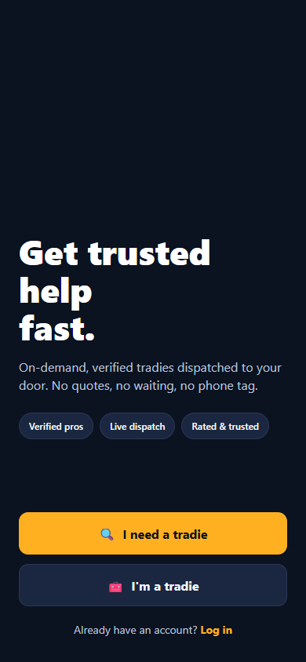
*Get trusted help in minutes — verified tradies, dispatched on demand.*

**What it costs**

| Item | Who pays | How |
|---|---|---|
| Using QuickieFix | Nobody — it's **free for customers** | No booking fees, no subscriptions |
| Labour (hourly rate + call-out fee) | You, directly to the tradie | The rate is shown **before** you commit and locked in when the tradie accepts |
| Parts & materials | You, directly to the tradie | **Extra** — agreed with you on site, itemised on your job summary |

That distinction matters: the price you see upfront is the **labour** rate (hourly rate plus any call-out fee). Any parts or materials the job needs are additional, and your tradie must agree them with you on site before they're used.

> 💡 QuickieFix is built for help **now**. There's no scheduling calendar to wrestle with — you request, we dispatch the nearest available verified pro.

---

## 2. Getting started

### Create an account

1. Open the app and tap **Sign up** on the welcome screen.
2. Enter your **first name**, **last name**, **email** and a **password** (at least 6 characters).
3. Tap **Create account**. You're taken straight to your home screen.

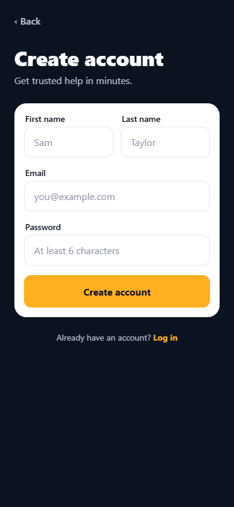
*Four fields and you're in — no payment details required.*

> 💡 Are you a tradie? Use **Join as a tradie** instead — tradie accounts go through verification and have their own app experience.

### Log in

1. Tap **Log in** on the welcome screen.
2. Enter your email and password, then tap **Log in**.

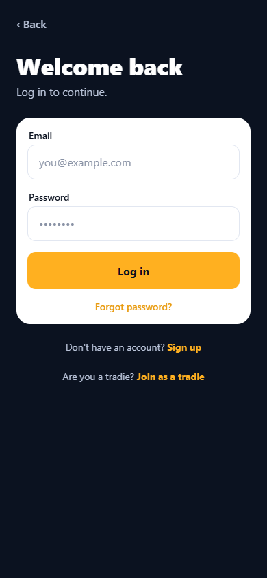
*Welcome back — log in to continue.*

### Forgot your password?

1. On the login screen, type your **email** into the Email field first.
2. Tap **Forgot password?** below the Log in button.
3. If an account exists for that email, we send a reset link. Check your inbox — and your spam folder.

> 💡 Once you're logged in, you can enable fingerprint/face unlock under **Sign-in & security** in your Account tab so you never type the password again.

---

## 3. The home screen

The home screen is mission control: everything starts here.

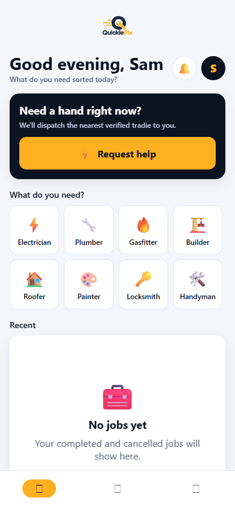
*Greeting, live tradie availability, the Request help button, trade shortcuts and your recent jobs.*

From top to bottom you'll see:

| Element | What it does |
|---|---|
| **Greeting** | "Good morning, Sam" plus *What do you need sorted today?* |
| **Bell & avatar** | The bell opens Activity (with a badge counting active jobs); the avatar opens your Account |
| **Request in progress banner** | If you have a live request, it's pinned at the top with **Continue** and **Cancel** buttons |
| **Live supply pill** | A green pill reading **"N verified tradies near you now"** — real availability, right now |
| **Supply line** | e.g. *Nearest verified pro ~12 min away · call-out from $59* — anchored to your saved home address |
| **Request help** | The big amber button. When we know the nearest pro's ETA it reads **Request help · ~12 min** |
| **What do you need?** | A grid of trade tiles — tap one to start a request with that trade pre-selected. QuickieFix covers 12 trades (full list below) |
| **Recent** | Your last few completed or cancelled jobs — tap any to reopen its summary |

**The 12 QuickieFix trades**

| Trade | | Trade | |
|---|---|---|---|
| ⚡ Electrician | 🔧 Plumber | 🔥 Gasfitter | 🏗️ Builder |
| 🏠 Roofer | 🎨 Painter | 🔑 Locksmith | 🛠️ Handyman |
| 🔌 Appliance Repair | 🌿 Landscaper | 🧽 Cleaner | 🐜 Pest Control |

> 💡 Save your home address in **Account** — the live supply pill and ETA on the home screen are anchored to it, so the numbers you see reflect your actual street, not a city-wide average.

---

## 4. Requesting help

Tap **Request help** (or a trade tile) and the app walks you through four quick steps: **Service → Details → Location → Review**. A progress bar at the top shows where you are, and the back chevron always takes you one step back.

### Step 1 — Pick a trade

Choose one of the 12 trades. If you started from a trade tile on the home screen, this step is already done and you land straight on Details.

### Step 2 — Describe the issue

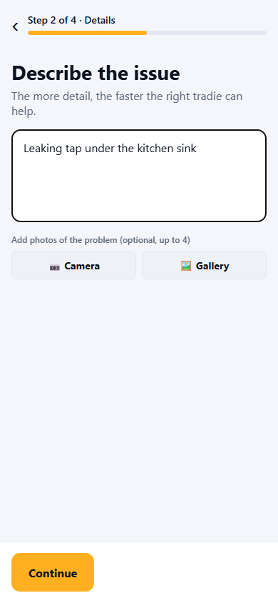
*A clear description and a photo or two get you the right tradie faster.*

1. Type what's wrong — e.g. *"My hot water cylinder is leaking in the garage."* At least a short sentence is required (5 characters minimum), but the more detail, the faster the right tradie can help.
2. Optionally add **up to 4 photos** using **📷 Camera** or **🖼️ Gallery**. Tap the ✕ on a thumbnail to remove it.

> 💡 A picture of the problem beats a paragraph. Tradies use your photos to bring the right gear on the first visit.

### Step 3 — Where's the job?

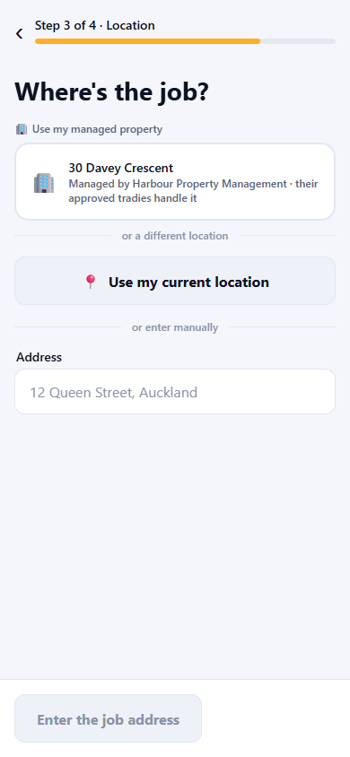
*Saved properties, your current location, or a typed address — your choice.*

You have three ways to set the location:

- **A saved property** — if you own or rent a property linked to your account it appears at the top. Managed (agency) properties are listed first with a 🏢 icon. One tap fills the address.
- **Use my current location** — tap 📍 and the app pins where you're standing.
- **Type the address** — start typing and pick from the suggestions. Suggestions are **New Zealand addresses only**.

When the address is pinned to exact coordinates you'll see **✓ Location pinned — tradies see exact distance**.

### Step 4 — Review and go

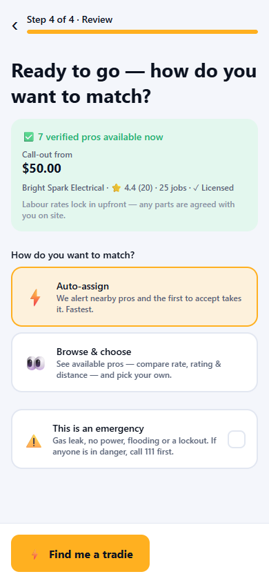
*Live proof before you commit: who's available, how far, and the from-price.*

Before you submit, the app shows a **live availability preview** for your trade at your address:

- **✅ N verified pros available now**
- **Nearest arrives in ~X min** (when your location is pinned)
- **Call-out from / Hourly from $Y** — the cheapest labour rate among available pros
- The nearest pro's business name, star rating, completed-job count and licence tick

Under the preview: *Labour rates lock in upfront — any parts are agreed with you on site.*

**How do you want to match?**

| Option | What happens |
|---|---|
| ⚡ **Auto-assign** | We alert nearby pros and the first to accept takes the job. Fastest. |
| 👀 **Browse & choose** | You see the available pros — compare rate, rating and distance — and pick your own. |

**This is an emergency** — tick this for a gas leak, no power, flooding or a lockout. Emergency jobs jump the search queue and are **always auto-assigned for speed** (Browse & choose is disabled).

> ⚠️ QuickieFix is not an emergency service. If there's a fire, a smell of gas, risk of electrocution, or **any danger to life — call 111 first**. When you tick the emergency box, the app shows a **Call 111 now** button for exactly this reason.

Tap **Find me a tradie** (or **Browse tradies**) and you're off.

> 💡 Changed your mind mid-request? Backing out of a partly-filled request asks you to confirm before discarding, so a stray tap won't lose your photos and description.

---

## 5. Renting a managed property

If you rent through a property management agency, QuickieFix can route repairs at your place through your property manager — often at **no cost to you**.

### Link your property manager

1. Get your **agent code** from your property manager's invite (it looks like `QF-AG-7K2P`).
2. Go to **Account → 🏢 Property manager**, enter the code and tap **Link my property manager**.
3. The agency is asked to confirm you as their tenant — your link shows **⏳ Pending**, then **✓ Confirmed** once approved.
4. When the agency adds you to your property, it appears under **🏠 Properties** in your Account and at the top of the location step whenever you request help.

> 💡 Confirmed but your address hasn't appeared? The app tells you: ask your property manager to add you to your property so repairs there are one tap away.

### Requesting help at a managed property

Pick your managed property in the location step, and at the Review step you'll be asked **Who's paying for this job?**

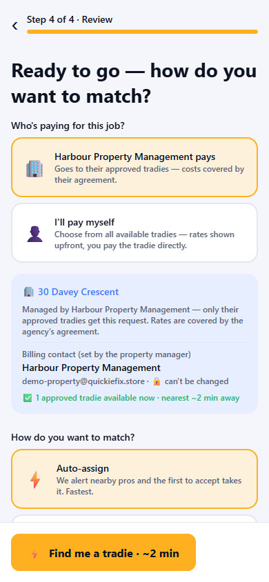
*At a managed property, you choose who pays — the agency (default) or yourself.*

| Choice | What it means |
|---|---|
| 🏢 **My property manager pays** (default) | The request goes **only to the agency's approved tradies**. Costs are covered by their agreement — you see no rates and pay nothing. The **billing contact is locked to the agency** (shown read-only with a 🔒 — it can't be changed). |
| 👤 **I'll pay myself** | A normal open-market job: choose from **all** available tradies, labour rates shown upfront, and you pay the tradie directly. |

When the agency pays, the review screen shows how many of their approved tradies are available right now. If none are online, your request still goes out — they're notified the moment they're back.

---

## 6. While we find your tradie

After you submit an auto-assigned request, you land on the searching screen.

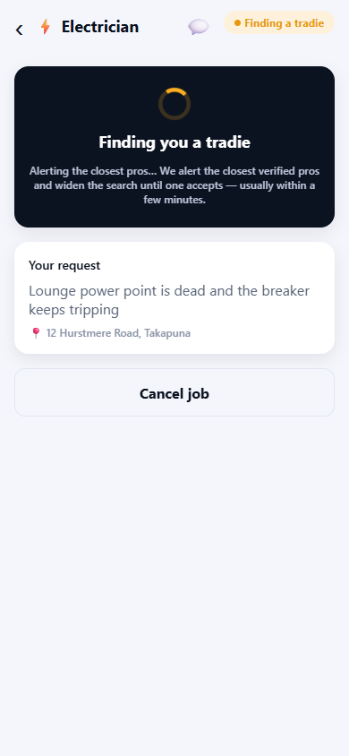
*We alert the closest verified pros and widen the search until one accepts.*

- The screen shows **Finding you a tradie** (or **🚨 Finding you help now** for emergencies) with a live progress spinner.
- Behind the scenes we alert the closest verified pros first, then widen the search in waves until one accepts — **usually within a few minutes**.
- If you chose **Browse & choose**, this screen instead lists the available pros with their rate, rating and distance so you can pick. Busy tradies are asked too and appear if they say yes.
- A tradie may **ask you a question** before accepting — it appears at the top of the screen. Quick replies help you get the right tradie faster.
- You can tap **Cancel job** at any time while searching — no charge, no penalty.

**If no tradie is found**

Occasionally nobody is free. The screen tells you honestly which case you're in:

- **No tradies available** — nobody in your area covers this right now. Try again shortly.
- **No tradie free right now** — pros exist but none could take it. **Our team has been alerted** and will try to line someone up; you can also tap **Try again** to resubmit immediately.

---

## 7. Your tradie is on the way

Once a tradie takes your job, the tracking screen walks you through every stage.

### Confirmed

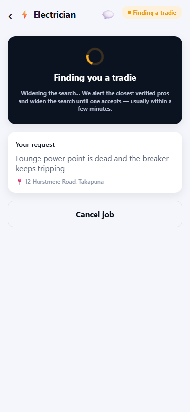
*Confirmed — your tradie's labour rates are locked in and shown upfront.*

- **✅ Confirmed · [Business] is getting ready to head over.**
- A **💷 Rates** card shows the labour rates that were **locked in at acceptance**: hourly rate, call-out fee, and after-hours call-out where applicable. *The tradie invoices you directly at these rates* — this card is your price record.
- The tradie's full profile card: business name, rating, completed jobs and qualifications.

### Travelling

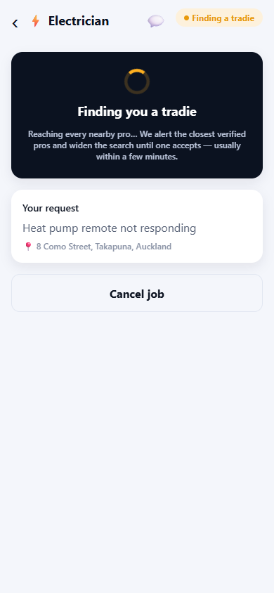
*Watch your tradie's live position move toward you on the map.*

- **🚗 [Business] is on the way** with live distance and ETA: *📍 Live · 4.2 km away · arriving in about 9 min.*
- The map shows your job location, with the tradie's **live phone position** as a moving amber marker.

### On site

When the tradie arrives you'll see **🛠️ Your tradie is on site and working on the job.**

Throughout, the screen also shows a **Progress** timeline, your original request (description, address and photos), and a **Cancel job** button — available up until the tradie is on site. Cancelling notifies the tradie.

> 💡 The 💬 icon in the header opens Messages at any stage — see the next section.

---

## 8. Messages

Every job has its own message thread with your tradie — tap the **💬** icon on the tracking screen.

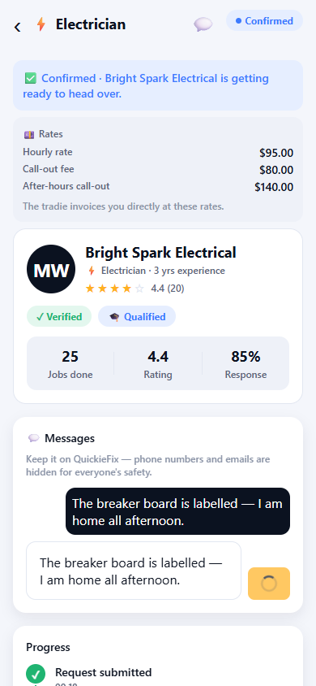
*Chat with your tradie in-app — with the job details and photos right there for context.*

- The thread shows **the job** (your description and photos) at the top, so the conversation always has context.
- **Contact details are masked for safety.** Phone numbers, email addresses and social handles are automatically redacted from messages when sent — all communication stays on the platform, where it's tied to your job record.
- **🧹 Messages and photos are deleted automatically when the job closes.** Once a job is completed or cancelled, the thread is wiped by the server. If you need something kept, act on it before the job ends.

> ⚠️ Never arrange payment through chat or move the conversation off-platform. Your upfront rates, completion code and complaint process only protect jobs that stay on QuickieFix.

---

## 9. Job complete

When your tradie marks the job done, the tracking screen turns celebratory.

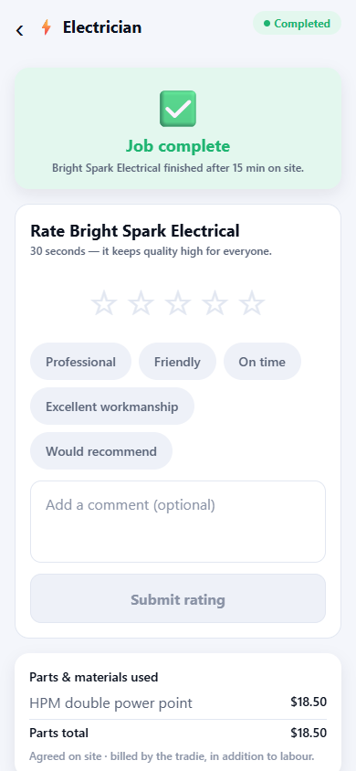
*Job complete — with time on site, parts itemised and your confirmation code.*

**Rate your tradie — 30 seconds**

Right under the green **Job complete** hero is the rating form. Pick a star rating and tap any tags that fit — *Professional, Friendly, On time, Excellent workmanship, Would recommend* — then submit. It takes 30 seconds and keeps quality high for everyone.

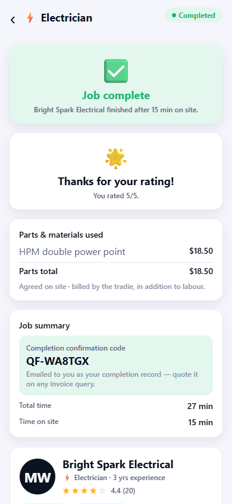
*Thanks for your rating — it's how the best tradies rise to the top.*

**Parts & materials used**

If the job used parts, they're itemised with quantities, per-item prices and a **Parts total**. Remember: parts are *agreed on site · billed by the tradie, in addition to labour* — nothing should appear here that wasn't discussed with you.

**Job summary and completion code**

The summary card shows **Total time** and **Time on site**, plus your **Completion confirmation code** — a short code that is **emailed to you as your completion record**. **Quote it on any invoice query** with the tradie or with QuickieFix support.

**Something wrong?**

Tap **Report a problem** at the bottom, enter a subject (e.g. *"Tradie didn't finish the job"*) and any detail, and submit. Our team reviews every complaint and will be in touch.

---

## 10. Activity

The **Activity** tab is your full job history — every job you've ever requested, newest first, each with its trade, address and current status (searching, confirmed, travelling, on site, completed, cancelled).

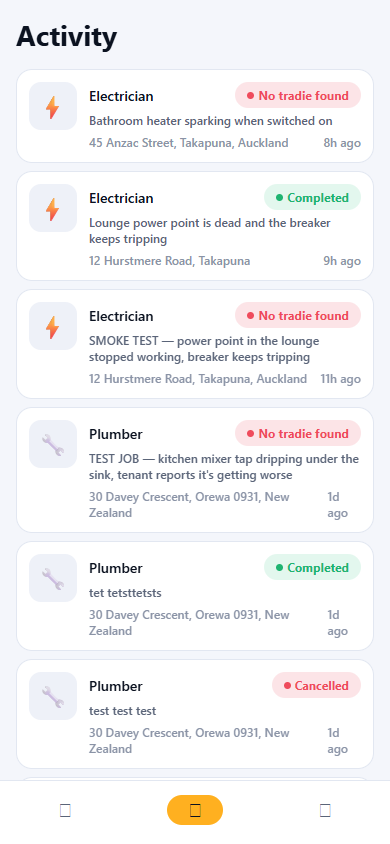
*Every job, every status — tap any card to reopen its tracking screen or summary.*

Tap any job card to reopen it: active jobs open live tracking; finished jobs open the summary with rates, parts, times and your completion code.

> 💡 The bell icon on the home screen is a shortcut straight here, with a badge showing how many jobs are currently active.

---

## 11. Your account

The **Account** tab holds your profile, addresses, properties and support tools.

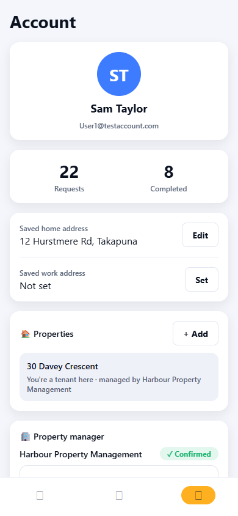
*Profile, saved addresses, properties, property manager link, support and security.*

### Saved addresses

Save a **home** and **work** address. Tap **Set** (or **Edit**) next to either, start typing, pick from the NZ address suggestions and save. Your home address powers the live availability and ETA on the home screen; both addresses speed up the location step. Clearing the field and saving removes an address.

### Properties (landlords)

Own a rental? Tap **+ Add** in the 🏠 Properties card, give it an optional label (e.g. *Unit 4, Takapuna*) and the address, and tap **Add property**. Then, for each property:

- **Link tenants** by entering the email they use on QuickieFix, so they can request repairs at your property in one tap. Unlink anyone at any time.
- As the property owner you become the **payer of record** for jobs at that property, and you get **visibility plus an emailed record of every job** done there. Recent jobs at your properties are listed right in the card.
- **Remove property** takes it off your account and unlinks its tenants — past jobs and their records are unaffected.

### Property manager (tenants)

The 🏢 Property manager card is where you link an agency with your agent code — see [section 5](#5-renting-a-managed-property) for the full flow and what it unlocks.

### Help & support

Tap **Contact QuickieFix** in the 🛟 Help & support card, enter a subject and message, and send. Your ticket goes straight to the QuickieFix team's back office and ops inbox — we reply in-app or by email.

### Sign-in & security

Enable biometric unlock (fingerprint/face) so you can open the app without typing your password.

### Delete my account

At the bottom of the tab, **Delete my account** permanently removes your profile, addresses and sign-in.

> ⚠️ Deletion is **permanent and cannot be undone**. Completed-job records are kept in **de-identified form** (no longer linked to you) as required by billing law. Log out first if you just want to switch accounts.

---

## 12. Pricing & FAQ

**How much does QuickieFix cost me?**
Nothing. QuickieFix is completely free for customers — no booking fees, no subscriptions. You pay the tradie directly for the work.

**What exactly am I paying the tradie?**
Labour, at the rates shown upfront: an **hourly rate** plus any **call-out fee** (a higher after-hours call-out may apply outside normal hours). These rates are visible before you commit and locked in when the tradie accepts — they appear on your Confirmed screen and in your job summary.

**What about parts and materials?**
Parts are **extra** and must be **agreed with you on site** before they're used. They're itemised, with a total, on your completed-job screen, and billed by the tradie in addition to labour.

**How are tradies verified?**
Every tradie on QuickieFix is verified before they can take jobs. For regulated trades (electricians, plumbers, gasfitters, builders) that includes checking the required licences and qualifications — you'll see a **✓ Licensed** tick and their rating, completed-job count and qualifications on their profile card.

**Can I pick my own tradie?**
Yes — choose **Browse & choose** at the review step to compare available pros by rate, rating and distance. Emergencies are always auto-assigned for speed.

**Can I cancel?**
Yes, free of charge, any time while we're searching — and up until the tradie is on site (they'll be notified).

**What if I have a problem after the job?**
Use **Report a problem** on the completed-job screen, and quote your **completion confirmation code** (emailed to you) on any invoice query. For anything else, raise a ticket via **Help & support** in your Account.

**Where is QuickieFix available?**
We're launching on Auckland's **North Shore** first, with more of New Zealand to follow. The live supply pill on your home screen always tells you exactly how many verified tradies are near you right now.

> 💡 The fastest way to a great result: clear description, a couple of photos, a pinned address — and 30 seconds to rate your tradie when it's done.
