# QuickieFix Property Agent Manual

| | |
|---|---|
| **Version** | 2.0 |
| **Date** | 15 July 2026 |
| **Audience** | Property managers & agencies |
| **Portal** | https://portal.quickiefix.app |

---

## Contents

1. [What QuickieFix does for your agency](#1-what-quickiefix-does-for-your-agency)
2. [Getting started](#2-getting-started)
3. [Your portfolio — the Properties page](#3-your-portfolio--the-properties-page)
4. [Your tradie panel](#4-your-tradie-panel)
5. [How tenant repairs work](#5-how-tenant-repairs-work)
6. [Desk dispatch — Request help](#6-desk-dispatch--request-help)
7. [The Jobs board](#7-the-jobs-board)
8. [Owner reports](#8-owner-reports)
9. [Support & Settings](#9-support--settings)
10. [FAQ](#10-faq)

---

## 1. What QuickieFix does for your agency

QuickieFix turns your maintenance desk into an automated pipeline. Instead of fielding calls, ringing around tradies and chasing paperwork, your agency gets:

| You get | How |
|---|---|
| **Tenant self-reporting** | Tenants report faults from their own phone, at their linked property, photos included — no call to your office needed. |
| **Panel-only dispatch** | Jobs at your managed properties go **only to your approved panel** of tradies and trade companies. Nobody you haven't vetted ever gets dispatched to your properties. |
| **Your commercial terms** | Panel jobs run under your agency's commercial agreement. Rates are **hidden in-app** for those jobs — tradies see the work, not a price negotiation. |
| **Live tracking** | Every job has a live status (searching → confirmed → travelling → on site → completed) visible to you on the portal and to the tenant in their app. |
| **Owner-ready records** | Every job produces a documented record — trade, issue, tradie, dates, time on site, tenant rating, parts used — exportable per property for your monthly owner statements. |

You run all of this from one place: **https://portal.quickiefix.app**.

> 💡 **Founding pilot:** QuickieFix is free for founding pilot agencies. There is no portal subscription fee during the pilot.

---

## 2. Getting started

### 2.1 Create your agency account

1. Go to **https://portal.quickiefix.app**.
2. Click **Create one** under the sign-in form.
3. Select **🏢 Property agency** (not Trade company).
4. Enter your **agency name**, **your name**, **email** and a **password** (at least 6 characters).
5. Click **Create agency**.

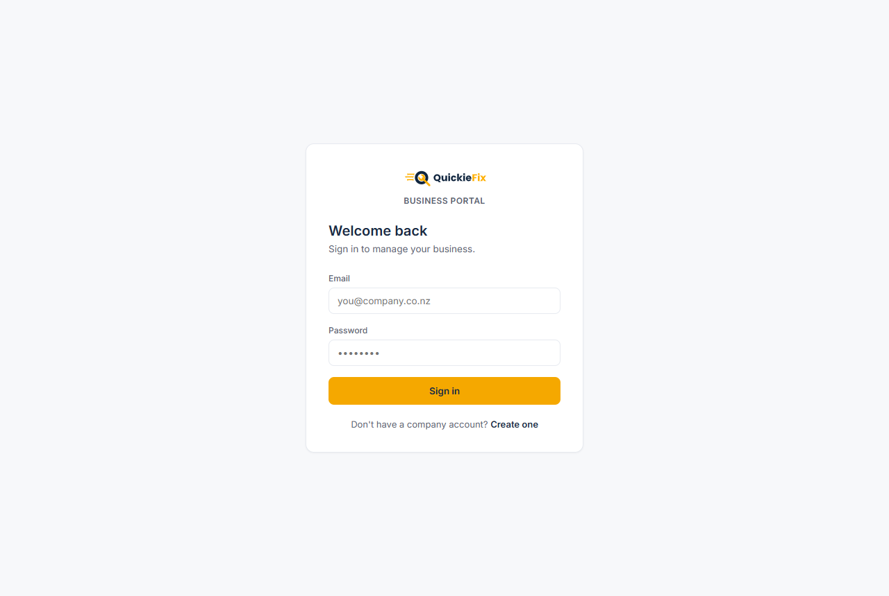
*The Business Portal login — choose 🏢 Property agency when creating your account.*

### 2.2 Your agent code — `QF-AG-XXXX`

Your agency is issued a unique **agent code** in the format `QF-AG-XXXX` the moment the account is created. This code is the key that links everything to your agency:

- **Tenants** enter it in their app (**Account → 🏢 Property manager**) to connect to you.
- **Individual tradies** enter it in their app (**Profile → 🏢 Property agents**) to request a place on your panel.
- **Trade companies** enter it in their portal (**Settings → Property agents**) to put their team on your panel.

Every invite email you send from the portal carries this code automatically. You can view and copy it at any time on the **Settings** tab.

> ⚠️ Anyone who enters your code only **requests** a link — nothing happens until **you** approve or confirm them in the portal. The code is safe to share widely.

### 2.3 The dashboard setup checklist

On first sign-in, the dashboard shows a **"Get your portfolio live"** checklist with a progress bar:

1. **Create your agency account** — done.
2. **Add your first property** — your portfolio decides which jobs route to your panel.
3. **Build your tradie panel** — invite the tradies and companies you trust; only they get your jobs.
4. **Invite your tenants** — they report repairs themselves; you keep the paper trail.

Each step has a button that jumps you straight to the right tab. Once all steps are ticked (or the first real job flows), the checklist retires and the working dashboard takes over: KPI tiles (**Properties · Tenants linked · Panel members · Jobs active/done**) and a live table of the most recent jobs at your properties.

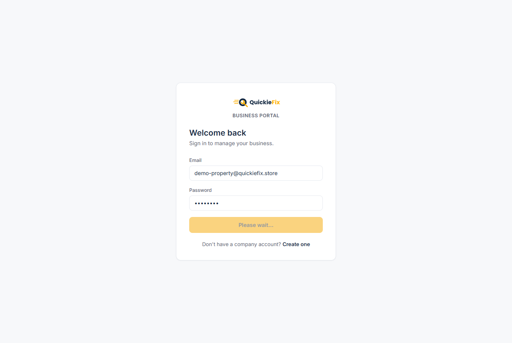
*The dashboard — setup checklist, portfolio KPIs and a live feed of jobs at your properties.*

> 💡 You are also **emailed on every job** raised at a managed property — you never have to sit watching the portal.

---

## 3. Your portfolio — the Properties page

Everything on QuickieFix hangs off a property: jobs are always raised **against a property**, and a property decides which tenants can report there and which panel receives the work.

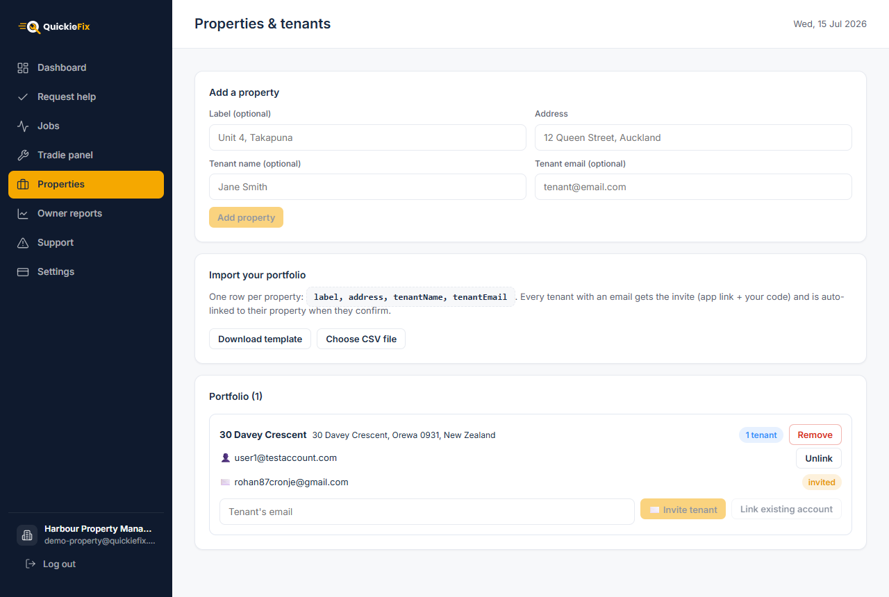
*Properties & tenants — add properties one at a time, import in bulk, and manage tenant links per property.*

### 3.1 Add a property

In **Properties → Add a property**:

1. **Label (optional)** — how your office knows it, e.g. *"Unit 4, Takapuna"*. Used everywhere the property is shown; the street address stays underneath.
2. **Address** — start typing and pick from the **NZ address autocomplete**. Selecting a suggestion **pins exact coordinates** to the property — you'll see *"✓ Location pinned — tradies get exact distances"*. This is what makes dispatch distances accurate, so always pick from the list rather than free-typing.
3. **Tenant name and tenant email (both optional)** — fill these in and one click does two things at once: it adds the property **and** emails the tenant an invite containing the app download link, **your agent code** and their property address. The button label changes to **Add property & invite tenant** when an email is entered.

When the tenant installs the app, creates a **customer** account with that email and enters your code, you confirm them in the portal and they are **auto-linked to this exact property** — repairs are then one tap away for them.

### 3.2 Bulk import your portfolio

For an existing rent roll, use **Import your portfolio**:

1. Click **Download template** — a CSV with the header `label,address,tenantName,tenantEmail`.
2. Fill it in: **one row per property**. `label`, `tenantName` and `tenantEmail` are optional; `address` is required.
3. Click **Choose CSV file** and select your file. The portal validates every row and shows what's ready and what has issues (missing address, invalid tenant email) before anything is imported.
4. Click **Import N properties**. A progress counter runs as each row lands.

Every row with a tenant email triggers the same invite email (app link + your code + their address), and each tenant **auto-links to their own property** when they confirm.

> 💡 Rows with issues are skipped, not imported — fix them in the CSV and re-import just those rows.

### 3.3 Tenants: invite, link, unlink

Each property card on the portfolio list has its own tenant tools:

- **✉️ Invite tenant** — type an email into the property's tenant box and send an invite tied to that property. The email shows as **invited** (amber chip) on the card until they confirm.
- **Link existing account** — if the tenant already has a QuickieFix customer account, type their email and click **Link existing account**. Tenants who have already confirmed your agency code appear as **suggestions** in the box, so you can pick them without retyping.
- **Unlink** — removes a tenant from the property. Their past jobs are unaffected.
- **Remove** (top-right of the card) — removes the property from your portfolio. Any linked tenants lose the property in their app; **past jobs and their records are unaffected**.

**Tenant confirmations.** When an invited tenant enters your code in their app, they appear at the top of the Properties tab under **Tenants waiting for confirmation**. Clicking **Confirm** approves them **and** auto-attaches them to the property they were invited to (matched by email).

> ⚠️ **The amber warning card.** If a tenant confirmed your code but their email didn't match any property invite, they show in an amber **"Confirmed tenants without a property"** card. These tenants **cannot see their rental or raise repairs** until you link them: find their property in the list and type their email into its tenant box (they'll appear in the suggestions), then click **Link existing account**.

---

## 4. Your tradie panel

Your panel is the closed list of tradies and trade companies allowed to receive jobs at your managed properties. Nothing dispatches off-panel at a managed property when the agency is paying.

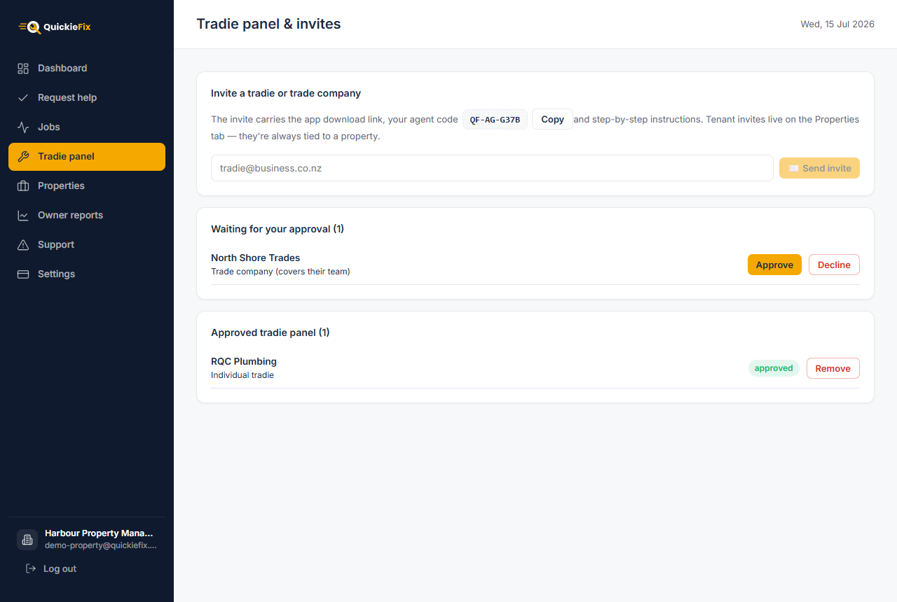
*Tradie panel & invites — send invites, action pending requests, and manage the approved list.*

### 4.1 Invite tradies and trade companies

In **Tradie panel → Invite a tradie or trade company**, enter their email and click **✉️ Send invite**. The invite carries the app/portal link, **your agent code** and role-specific step-by-step instructions:

- **Sole tradie** — downloads the app, signs up as a tradie, then enters your code under **Profile → 🏢 Property agents**.
- **Trade company** — signs in at the Business Portal and enters your code under **Settings → Property agents**, choosing whether the membership covers their **whole team** or **employees only**.

> 💡 Tenant invites do **not** live here — they're on the Properties tab, because a tenant invite is always tied to a specific property.

### 4.2 Approve or decline requests

Every membership request — tradie or company — waits in **Waiting for your approval** until **you** act on it. Click **Approve** or **Decline**; a confirmation dialog spells out exactly what approval means before you commit.

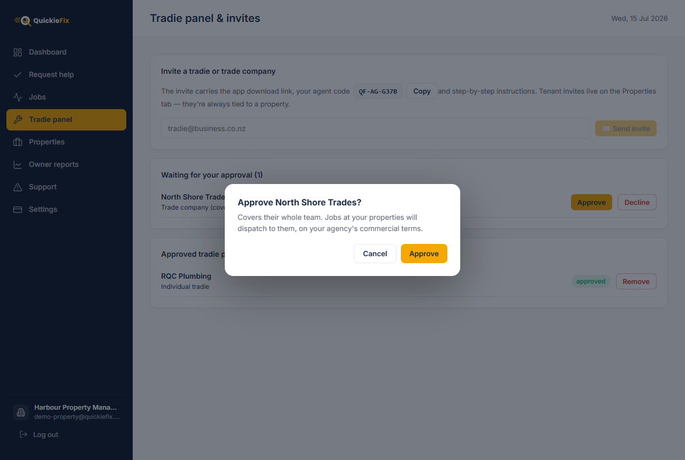
*The approval dialog — for a company it states whether the membership covers their whole team or employees only, and that jobs dispatch on your agency's commercial terms.*

### 4.3 Individual tradie vs trade company membership

| | Individual tradie | Trade company |
|---|---|---|
| **Who serves you** | That one tradie, as their **own business** | The company's team — **their choice** of the whole roster or **employees only** (contractors excluded) |
| **Who chose the scope** | n/a | The company admin, when they entered your code |
| **Billing chain** | Agency → tradie | Agency → **company** → tradie |

A company membership means any covered, available team member with the right trade can be dispatched to your properties — the company handles its own people, and the commercial relationship runs agency → company → tradie.

### 4.4 Remove a panel member

Click **Remove** next to any approved member. They **stop receiving jobs at your properties immediately**. Jobs already in progress are unaffected.

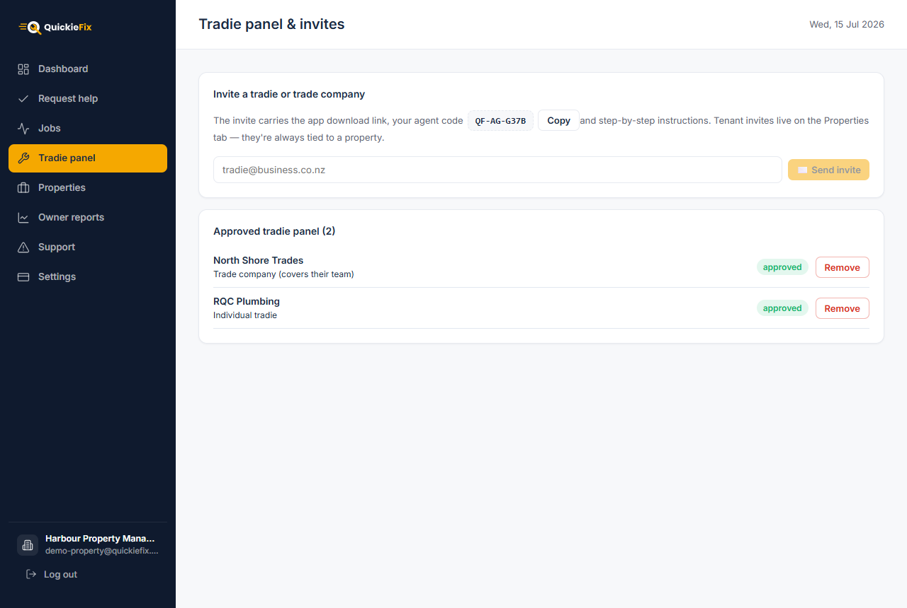
*The approved panel — each member shows their type (individual tradie or trade company, with scope) and can be removed at any time.*

---

## 5. How tenant repairs work

Once a tenant is confirmed and linked, their property appears in the QuickieFix app as a one-tap job location. When they report a fault there — trade, description, photos — the app recognises it as an **agency-managed property** and asks one extra question: **who's paying for this job?**

*The tenant's phone — at a managed property, the tenant chooses who pays before dispatch.*

| Option | What happens |
|---|---|
| **🏢 "{Your agency} pays"** *(default)* | The job goes **only to your approved panel**. Rates are covered by your agency's agreement and are not shown or negotiated in-app. The **billing contact is locked to your agency** (name and email shown read-only, marked 🔒 can't be changed) — the completion record and any invoicing land with you, not the tenant. The job appears on your Jobs tab, and you're emailed. |
| **👤 "I'll pay myself"** | The tenant hires on the **open market** at their **own cost**: all available tradies, rates shown upfront, tenant pays the tradie directly. |

The tenant tracks the job live in their app throughout — matched tradie, travelling, on site, complete — without ever calling your office.

> 💡 The agency-pays option is pre-selected. Tenants have to actively opt out to pay themselves, so maintenance flows to your panel by default.

---

## 6. Desk dispatch — Request help

Some tenants will still ring the office. The **Request help** tab lets you raise the job for them while they're on the phone — same panel-only dispatch, same tenant tracking.

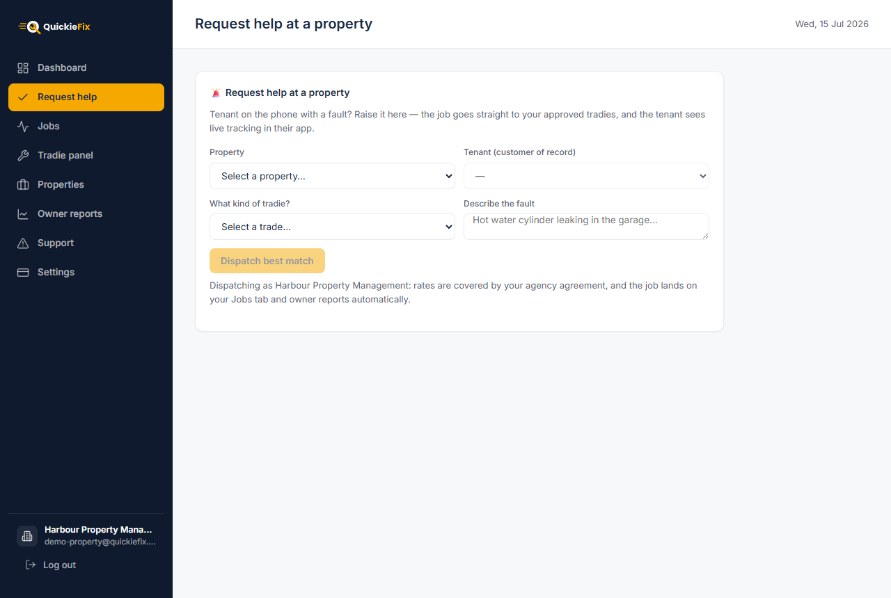
*Request help — pick the property, and the linked tenant auto-fills as the customer of record.*

1. **Pick the property.** The linked tenant **auto-fills as the customer of record** (if the property has several tenants, pick the caller; if none are linked yet, the job is raised as the agency).
2. **Pick the trade** — plumber, electrician, and so on.
3. **Describe the fault** — a sentence is enough, e.g. *"Hot water cylinder leaking in the garage"*.
4. **Check "Available now on your panel."** A live list appears of every approved panel tradie of that trade who is online right now, with their business name, star rating and **distance from the property** (this is why pinned addresses matter). 
5. **Dispatch.** Leave **⚡ Best match** selected to ping the nearest available first with automatic escalation, or select a specific tradie and click **Dispatch this tradie**.

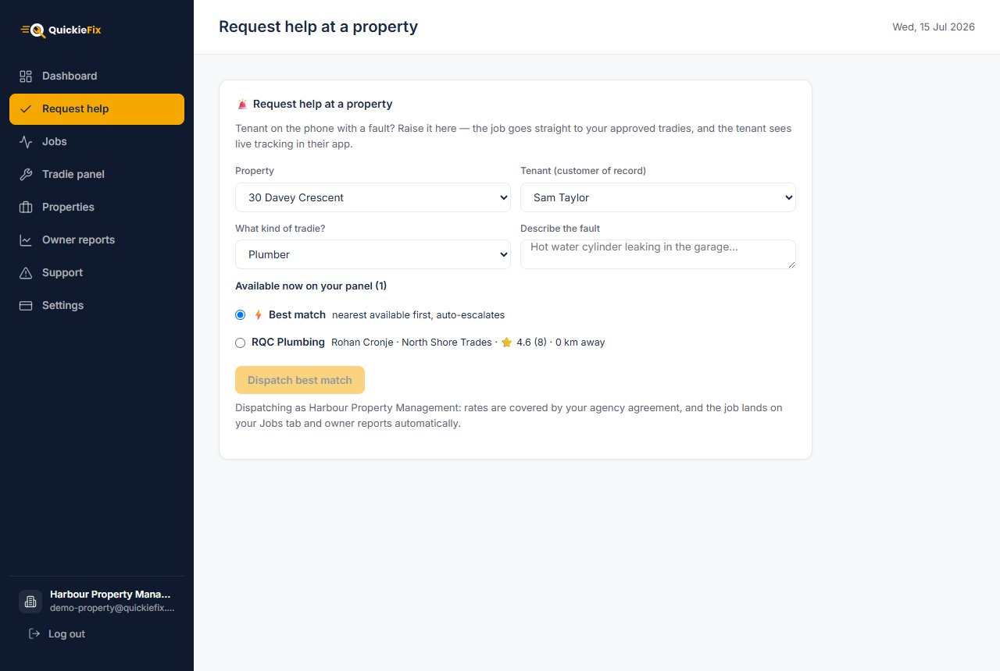
*A filled-in request — live panel availability with ratings and distances, best match or a hand-picked tradie.*

The moment you dispatch:

- The tenant **tracks the job live in their own app** — you can tell them so while they're still on the phone.
- The job lands on your **Jobs tab automatically** (the portal switches you there) and flows into owner reports.
- Rates are covered by your agency agreement — no pricing conversation happens.

> 💡 If none of your panel tradies of that trade are online, you can **still dispatch** — they are pinged the moment they come back online.

---

## 7. The Jobs board

The **Jobs** tab is the single view of every job at your managed properties — tenant-reported and desk-dispatched alike.

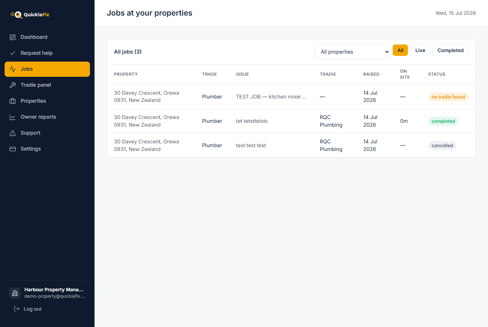
*All jobs at your properties — filter by property and by live/completed status.*

**Filters:**

- **Property dropdown** — narrow to a single property.
- **All / Live / Completed** — *Live* means searching, confirmed, travelling or on site.

**Columns:** Property · Trade · Issue · Tradie · Raised · On site (time from arrival to completion) · Status.

**Statuses** update live, no refresh needed:

| Status | Meaning |
|---|---|
| `searching` | Pinging your panel for a match |
| `confirmed` | A tradie has accepted |
| `travelling` | Tradie en route to the property |
| `on site` | Tradie at the property, working |
| `completed` | Done — the record (and confirmation code) is generated |
| `cancelled` | Job was cancelled |
| `no tradie found` | No panel member picked it up — see [FAQ](#10-faq) |

---

## 8. Owner reports

The **Owner reports** tab is your deliverable to property owners: everything that happened at their asset, ready to attach to the monthly statement.

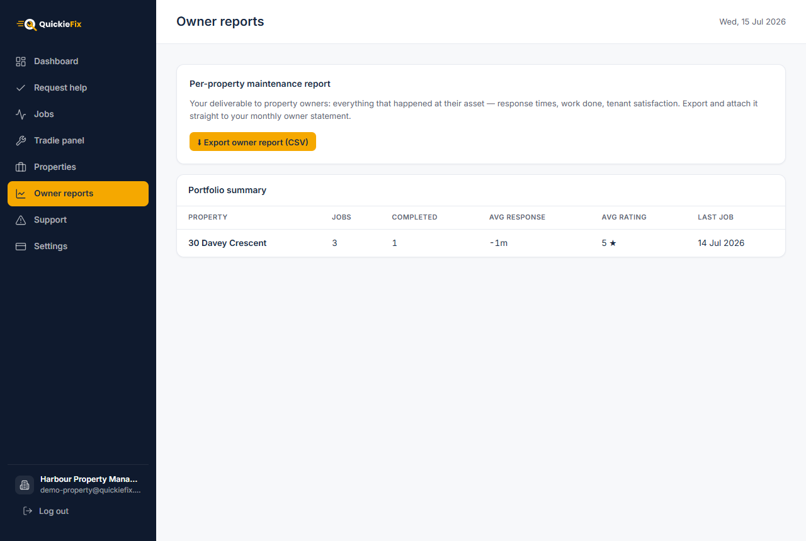
*Owner reports — per-property job history export and the portfolio summary.*

### 8.1 Per-property maintenance report (CSV export)

Click **⬇ Export owner report (CSV)** to download the full job history with one row per job:

| Column | Contents |
|---|---|
| Property | Street address |
| Trade | e.g. Plumber |
| Issue | The fault description |
| Tradie | Who did the work |
| Raised / Completed | Dates |
| On site (min) | Minutes from arrival to completion |
| Rating | The tenant's star rating |
| **Parts** | Parts & materials recorded at completion (description × qty) |
| **Parts total ($)** | The summed parts cost |

The file is named `{your-agency}-owner-report-{date}.csv` — filter it by property in your spreadsheet tool and **attach it straight to the monthly owner statement**.

### 8.2 Portfolio summary

Below the export, a live summary table shows one row per property: **Jobs · Completed · Avg response** (time from raised to a tradie confirming) **· Avg rating · Last job**. Use it to spot slow-response properties or ones generating unusual volume at a glance.

> 💡 Every completed job also generates a server-issued confirmation code (`QF-XXXXXX`) on its completion email — a tamper-proof reference if an owner or tradie ever queries an invoice.

---

## 9. Support & Settings

### 9.1 Support

The **Support** tab sends a ticket straight to the QuickieFix team — it's emailed to our ops desk immediately, and we reply to your agency admin email.

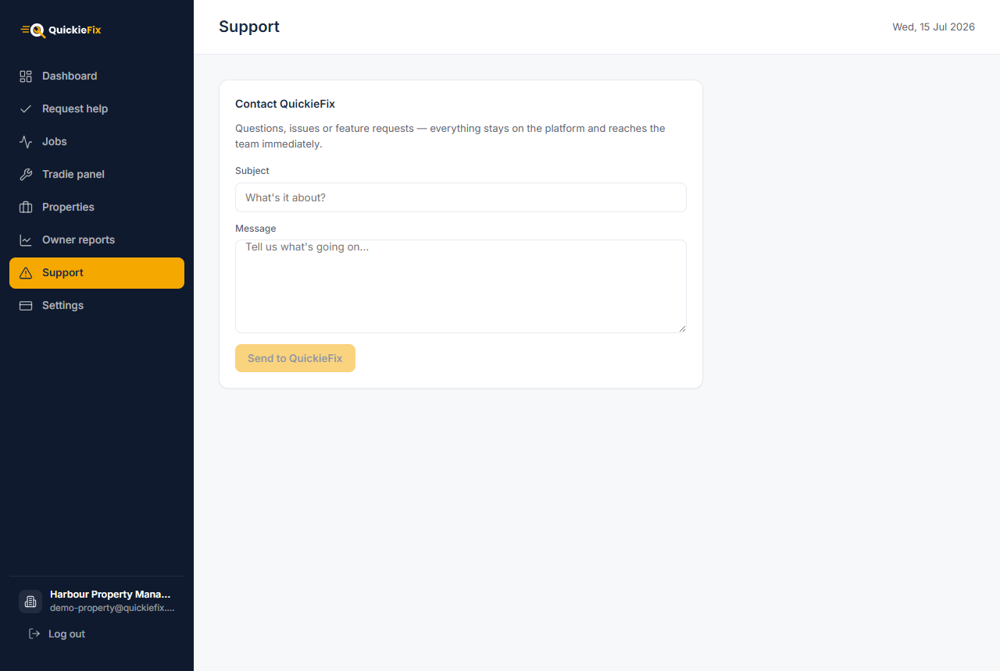
*Support — tickets go directly to the QuickieFix team.*

### 9.2 Settings

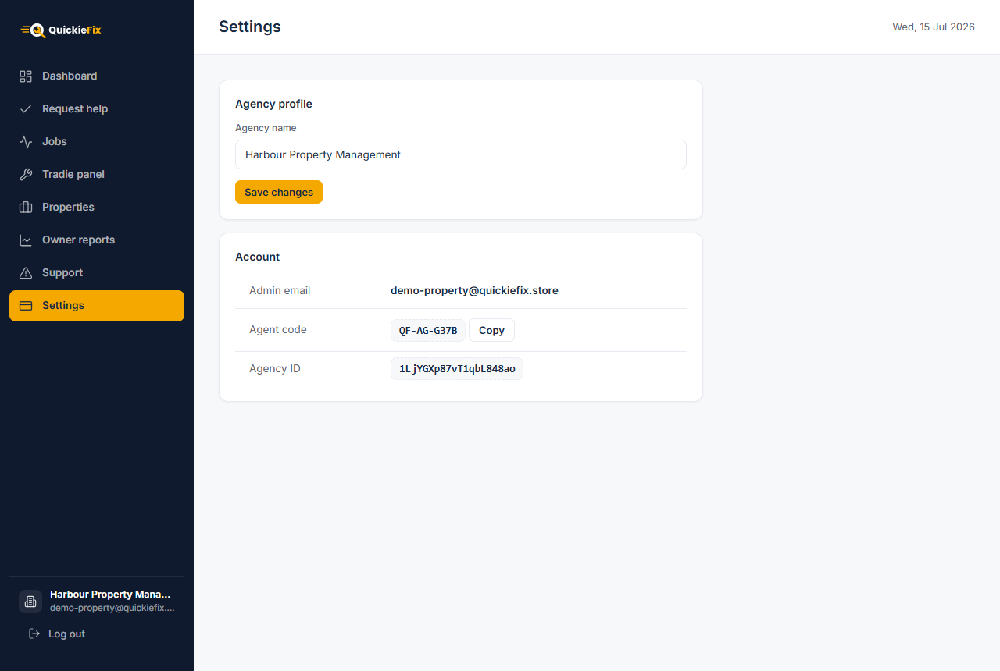
*Settings — rename the agency, and view/copy your agent code.*

- **Agency name** — edit and **Save changes**. The new name appears on future invites, dispatch messages and reports (refresh the portal to see it everywhere).
- **Account** — shows your admin email, your **agent code `QF-AG-XXXX`** with a one-click **Copy** button, and your agency ID (useful when contacting support).

---

## 10. FAQ

**A tenant confirmed my code but says they can't see their property in the app.**
Their invite email didn't match a property, so they confirmed without auto-linking. They'll be in the amber **"Confirmed tenants without a property"** card on the **Properties** tab. Find their property, type their email into its tenant box (they appear in the suggestions) and click **Link existing account**. The property appears in their app immediately and they can raise repairs.

**What do tradies see on jobs at my properties?**
The work, the address, the fault description and photos — but **no rates**. Jobs at your managed properties run under your agency's commercial agreement, so there is no in-app price display or negotiation for those jobs.

**What happens if no panel tradie is available?**
The job still dispatches and sits at `searching` — every matching panel member is pinged the moment they come online. The job **never leaves your panel**: QuickieFix will not send an off-panel tradie to a managed property on an agency-paid job. If nobody picks it up, it shows as `no tradie found` on your Jobs board — re-raise it later, dispatch a specific tradie from **Request help**, or widen your panel with more invites.

**Can a tenant bypass my panel?**
Only by choosing **"I'll pay myself"** at the who-pays step — that's an open-market job at their own cost, with the tenant as the billing contact. Any job billed to your agency is panel-only, always.

**Does removing a property or panel member destroy history?**
No. Past jobs keep their own stamped copies of the property and agency details — your Jobs board and owner reports are unaffected. Removing a panel member only stops **future** dispatches; removing a property only unlinks its tenants going forward.

**Who pays QuickieFix?**
During the founding pilot, the portal is free for agencies. Work itself is billed under your commercial agreement with your panel — agency → tradie for individuals, agency → company → tradie for company members.
