# QuickieFix Tradie Manual

| | |
|---|---|
| **Version** | 2.0 |
| **Date** | 15 July 2026 |
| **Audience** | Sole tradies & company tradies |
| **App** | my.quickiefix.app · Android app |

---

## Contents

1. [Welcome to QuickieFix](#1-welcome-to-quickiefix)
2. [Signing up](#2-signing-up)
3. [Your dashboard](#3-your-dashboard)
4. [Receiving job offers](#4-receiving-job-offers)
5. [Reviewing a job before accepting](#5-reviewing-a-job-before-accepting)
6. [Accepting a job](#6-accepting-a-job)
7. [Doing the job](#7-doing-the-job)
8. [Completing the job — parts & materials](#8-completing-the-job--parts--materials)
9. [Timesheets](#9-timesheets)
10. [Your profile](#10-your-profile)
11. [Money & billing in detail](#11-money--billing-in-detail)
12. [Rules & standing](#12-rules--standing)

---

## 1. Welcome to QuickieFix

QuickieFix is New Zealand's on-demand trades marketplace. Customers post a job, and it is dispatched to nearby, verified tradies in your trade. You see the job, decide whether you want it, and — if you're first to accept — it's yours. You deal directly with the customer, do the work at your own published rates, and invoice them yourself.

### How the money works

| Item | How it works |
|---|---|
| **Platform fee** | A flat **NZ$15 per completed job**. Nothing else. |
| **Your first 5 jobs** | **Free** — every approved tradie starts with 5 free job credits. |
| **Lead fees** | **None.** You are never charged to see, view, or decline a job. |
| **Commission** | **None.** QuickieFix takes no percentage of your labour or parts. |
| **Your labour** | Customers pay you **directly** at your published rates. You keep 100%. |
| **Parts & materials** | Extra, charged by you — but they **must be agreed with the customer on site before fitting** (platform rule, see Section 8). |
| **When you're charged** | Only when a job reaches **Completed**. Declined, released, or cancelled jobs cost nothing. |
| **How you pay** | Fees accumulate during the month and are **invoiced monthly** (on the 1st) to your billing email. There is no in-app payment. |

> ⚠️ **Unpaid platform fees put your account on a dispatch hold.** If your QuickieFix invoice isn't settled, a "Dispatch paused" banner appears on your dashboard and you stop receiving new jobs. Dispatch resumes as soon as the invoice is cleared.

> 💡 The maths is simple: a $15 fee on a job where you might bill $150–$500+ of labour and parts. If a job doesn't complete, you owe nothing.

### The tradie lifecycle at a glance

1. **Register** and get verified (Section 2).
2. **Go Available** on the dashboard (Section 3).
3. **Receive offers** by push notification (Section 4).
4. **Review** — photos, description, distance, area (Section 5).
5. **Accept** — the job locks to you and the exact address unlocks (Section 6).
6. **Travel, arrive, work** (Section 7).
7. **Complete** — confirm invoice details, add any parts, rate the customer (Section 8).
8. **Invoice the customer** yourself, using your Timesheets and the QF- confirmation code (Section 9).

---

## 2. Signing up

Open **my.quickiefix.app** (or the Android app), choose **Join as a tradie**, and complete the application form.

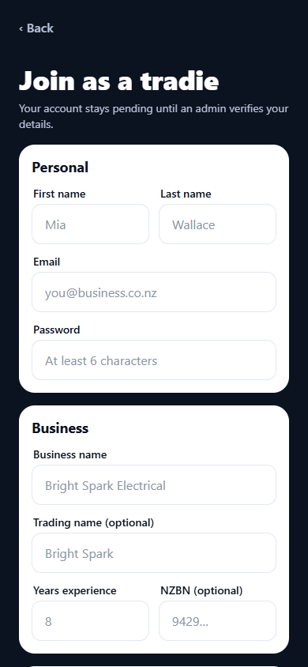
*The tradie application: personal details, business details, trades, licence, and service radius.*

### Step by step

1. **Personal** — first name, last name, email, and a password (at least 6 characters).
2. **Business** — your **business name** (required), an optional trading name, years of experience, and your **NZBN**. The NZBN field is optional at registration, but if you trade independently (not under a company seat) you **must** add it before invoicing — the app will prompt you on your Profile until it's saved. Invoices need a valid NZBN.
3. **Primary trade** — pick one from the list: Electrician, Plumber, Gasfitter, Builder, Roofer, Painter, Locksmith, Handyman, Appliance Repair, Landscaper, Cleaner, Pest Control.
4. **Secondary trades (optional)** — select any additional trades you're qualified to take jobs in. You'll receive offers for all of your trades.
5. **Licence & qualifications** — Electrician, Plumber, Gasfitter, and Builder are **regulated trades**: a licence number (e.g. EWRB-104882) is **required**, with an optional expiry date. Certificate and insurance uploads are requested during admin review.
6. **Service radius** — how far you'll travel for a job: **5, 10, 15, or 25 km**. You can change this later on your Profile.
7. Tap **Submit application**.

### Pending approval

Your account stays **pending until an admin verifies your details** — licence, qualifications, and business information. While pending:

- You can log in and finish your profile (rate card, NZBN, company/agency codes).
- You **cannot** receive job offers.
- Your dashboard shows an amber **"⏳ Account pending approval"** card, and your Profile shows a **"⏳ Pending approval"** banner that flips to **"✓ Verified & approved"** once you're cleared.

> 💡 Use the waiting time well: set your rate card (Section 10) so you're ready to go live the moment you're approved. On approval you also receive your **5 free job credits**.

---

## 3. Your dashboard

The dashboard is your home screen — everything you need on a working day lives here.

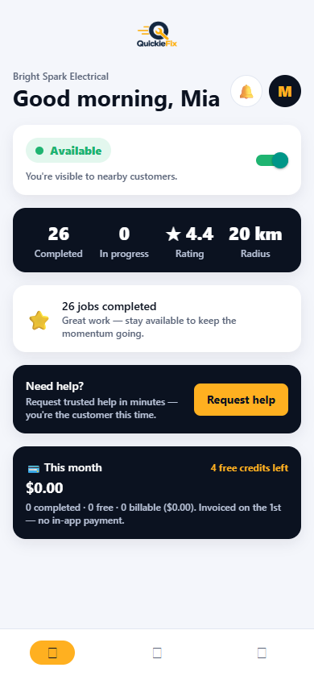
*The dashboard: availability toggle, operational summary, performance banner, and the money panel.*

### The availability toggle — THE control

The availability card sits right under your greeting because it's the most important control in the app:

- **Available** — you're in the dispatch pool. Flipping it **shares your current location** so jobs are matched by real distance from your phone. While you're Available, the app quietly refreshes your location whenever you open or foreground the app (at most every 2 minutes) so dispatch always uses where you actually are, not a stale point.
- **Off (Unavailable/Offline)** — you receive no offers. Flip it off at knock-off time, on holiday, or whenever you can't respond.

> ⚠️ **Keep your availability honest.** Being Available and ignoring offers hurts customers waiting for help — and your dispatch standing (Section 12). If you're done for the day, toggle off.

> 💡 Location permission is requested when you go Available. If GPS is off, you can still go Available, but distance-based matching works best with location on.

### What else is on the dashboard

| Element | What it shows |
|---|---|
| **Operational summary** (navy card) | Completed jobs, jobs in progress, your star rating (★ New until your first ratings), and your service radius — plus when you last completed a job. |
| **Performance banner** | An achievement badge: 🚀 *Ready to earn* (new), ⭐ *N jobs completed*, or 🏆 *Top-rated pro* (5+ ratings averaging 4.8★+). |
| **Active job card** | **GREEN** — deliberately the one live thing on the screen. Shows the trade, customer, status, and address. **Tap to manage →** opens the job screen. |
| **💳 This month (money panel)** | Completed jobs this month, how many were free (credits), how many are billable, the fee total, and your **free credits remaining**. "Invoiced on the 1st — no in-app payment." |
| **🔔 Bell badge** | A count of pending offers and selections. |
| **⏸️ Dispatch paused** | Appears only if you're on a payment hold (Section 11). |

### Need help? You can be the customer too

At the bottom of the dashboard is a **Need help?** card with a **Request help** button. Tradies can request services from other tradies exactly like a customer — your request shows under **Your requests** with live tracking.

> 💡 Blown a fitting outside your trade? A sparky can summon a plumber in minutes, and vice versa.

---

## 4. Receiving job offers

When a customer posts a job in your trade within your radius, you get a push notification — for example **"⚡ New job: Plumber"** — and an amber offer card appears at the top of your dashboard.

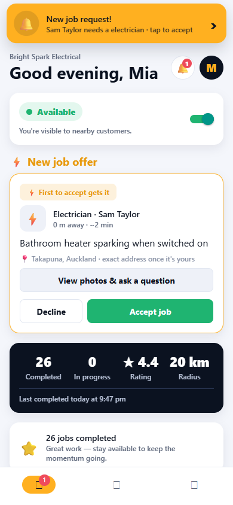
*A new job offer lands at the top of the dashboard — always first, never buried under stats.*

### How dispatch works

Jobs go out in **waves** to the nearest available tradies: the 3 closest first, widening to 8 at 90 seconds, then to all remaining matches at 3 minutes. The earlier you respond, the better your chance.

### Reading the offer card

The amber **⚡ New job offer** card carries a **"⚡ First to accept gets it"** banner and shows:

| On the card | Meaning |
|---|---|
| **Trade & customer name** | e.g. *Plumber · Sarah T.* |
| **Distance & ETA** | e.g. *3.2 km away · ~8 min* — measured from your phone's location. |
| **Job description** | The customer's own words (first two lines). |
| **📍 Area only** | Suburb/city, e.g. *📍 Ponsonby, Auckland · exact address once it's yours*. The street address stays private until you accept. |
| **🗓️ Wanted time** | Shown on scheduled (non-ASAP) jobs. |

Your options, right on the card:

- **Accept job** — take it immediately (Section 6).
- **Decline** — the offer disappears for you; no cost, and other tradies keep seeing it.
- **View photos & ask a question** — open the full job screen first (Section 5).

> ⚠️ **First to accept gets it.** These are live dispatch offers, not leads. If another tradie accepts while you're deciding, the offer is gone — the job screen will tell you it's been taken.

> 💡 Offers only appear while you have **no active job** in progress — you run one live job at a time per trade.

---

## 5. Reviewing a job before accepting

Not sure from two lines of description? Tap **View photos & ask a question** to open the full job screen.

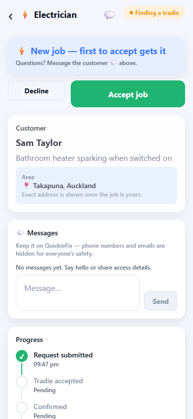
*The offer detail: the decision comes first — Accept/Decline sit on top, details below.*

### Decision first

The screen is built so the decision leads: the **"⚡ New job — first to accept gets it"** card with **Accept job** and **Decline** buttons sits at the very top. The detail below is slightly faded until the job is taken.

### What you can see before accepting

- **Full description** — the customer's complete write-up.
- **Photos** — swipe through anything the customer attached.
- **Area & rough distance** — e.g. *📍 Ponsonby, Auckland · ~3.2 km from you*. For privacy, the exact street address and map **only unlock once the job is yours**.
- **Wanted time** — for scheduled jobs.

### Ask the customer a question

Any candidate can message the customer **before accepting** — tap the 💬 icon in the header or scroll to the message thread. Ask about access, parking, the model of the appliance, whether the water's isolated — whatever helps you decide.

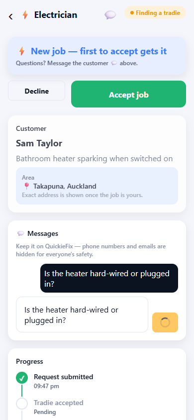
*Pre-accept messaging: ask what you need to know before committing.*

> 💡 **Contact details are masked.** All pre-accept messaging runs in-app — neither side sees the other's phone number or email. Keep the conversation on the platform (Section 12).

> ⚠️ Asking a question does **not** reserve the job. While you're chatting, another tradie can still accept it.

---

## 6. Accepting a job

Tap **Accept job** — on the dashboard card or the job screen. What happens next:

1. **You're locked in.** The job is assigned to you; the offer vanishes for every other candidate.
2. **The customer is notified immediately** that you've accepted, along with your business profile and rate card.
3. **The exact address and map unlock** for you — the full street address with an embedded map preview and an **Open in maps ↗** link.
4. Your dashboard shows the **green Active job card**, and your status changes to **Job accepted**.

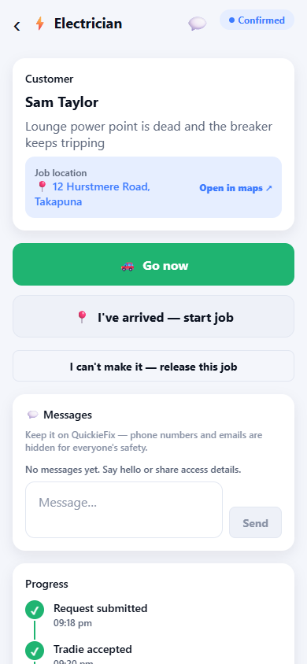
*Accepted: the exact address, map, and customer thread are now yours.*

For standard jobs the customer then confirms the booking (they have a 10-minute window); **emergency jobs auto-confirm within about 3 minutes** of your acceptance. Once confirmed, your travel controls appear (Section 7).

> ⚠️ **Accepting is a commitment.** The customer is told you're coming and other tradies stop being offered the job. Only accept work you genuinely intend to do. If something goes wrong before you arrive, use the release option (Section 7) — don't just go silent.

### One live job at a time

You carry **one active job per trade** at a time. While you're on a job, new auto-dispatch offers are held back until you complete it.

### The browse-and-choose variant

Some customers browse profiles instead of taking the first acceptor. Two extra card types can appear on your dashboard:

- **👀 Customers looking for you** — a nearby customer is browsing. Tap **I'm interested** to put your hand up (or **Not now** to dismiss). You're then on their list.
- **⭐ You've been selected** — the customer **picked you**. The job screen shows **"⭐ You've been chosen"** with **Accept — lock it in**. Accepting locks the job to you directly, with no extra confirmation step. Decline promptly if you can't take it, so the customer can pick someone else.

> 💡 Browse-and-choose selections are where your rating, rate card, and profile photo earn their keep — customers are comparing you against other tradies side by side.

---

## 7. Doing the job

Once the booking is confirmed, the job screen becomes your control panel.

### Heading out — Go now

1. Open the job (tap the green Active job card).
2. Tap **🚗 Go now**. Your status flips to **travelling** and the customer is told you're on the way.
3. The app offers to hand the address to your preferred maps app — **Open maps** launches Google Maps, Apple Maps, or Waze. You can re-open navigation any time with **🧭 Open address in maps**.

*Travelling: navigation at hand, live location shared, arrival one tap away.*

> 💡 **The customer sees you coming.** While you're travelling, your live phone position is shared with the customer (updated roughly every 20 seconds) so their tracking screen shows a real distance and ETA. This ends when the job does.

### Arriving — start the job

Two ways to flip to **On site**:

- **Automatic (geofenced):** when your phone comes within about **150 m** of the property, the app auto-detects arrival and starts the on-site clock.
- **Manual:** tap **📍 I've arrived — start job** — always available, and the fallback if GPS is patchy.

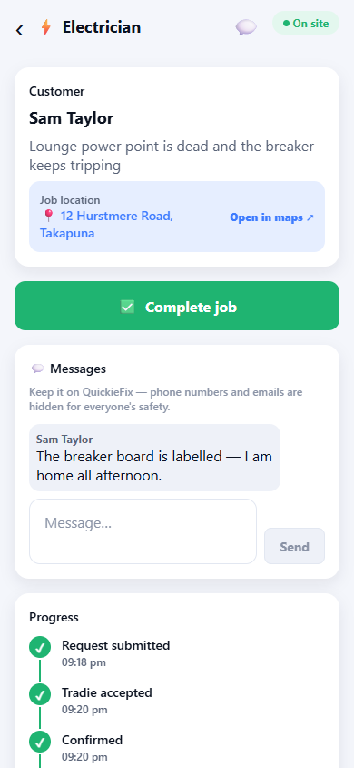
*On site: the working clock is running; the Complete job button is ready when you are.*

The on-site timestamp matters: it starts your **working time** clock, which feeds your Timesheets (Section 9) and the durations on the completion summary — evidence for your invoice.

### Can't make it? Release the job — before you arrive

If your van dies, you're injured, or you can't reach the customer, use **"I can't make it — release this job"** (available while the job is accepted, confirmed, or travelling — **not once you're on site**).

What happens when you release:

- The customer is **told you couldn't make it**.
- Dispatch **restarts immediately** — other tradies are alerted.
- The job **won't be offered to you again**.
- You are **not charged** (fees apply only to completed jobs).

> ⚠️ Releasing is an escape hatch, not a browsing tool. It disrupts a customer who was told you were coming — repeated releases damage your standing and future dispatch priority (Section 12). If you're only running late, message the customer instead.

---

## 8. Completing the job — parts & materials

When the work is done, tap **✅ Complete job** on the job screen.

### Invoice details

For a standard job, a short **Invoice details** form opens:

1. **Invoice contact** — who your invoice goes to (prefilled from the customer's account; confirm it with them on site — it might be a landlord or office).
2. **Invoice email** — where the completion record is sent (prefilled; editable).

The **completion record and QF- confirmation code go to this contact.** Your own invoice should reference the code — it's the customer's proof the job was done through QuickieFix.

**Agency jobs are different:** if the job came through a property agency panel (Section 10), billing is **locked to the agency** — there's no form to fill. The screen shows *"🏢 Billed to [Agency] · 🔒 set by the agency"* and the completion record goes to the agency automatically.

### ＋ Add parts & materials (optional)

If you fitted parts or used materials, record them before completing. Tap **＋ Add parts & materials (optional)**:

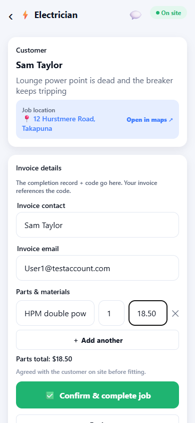
*The parts editor: description, quantity, and price per unit, with a live running total.*

For each line enter:

| Field | Example |
|---|---|
| **Part or material** | *15 mm ball valve* |
| **Qty** | *2* |
| **$ each** | *24.50* |

Tap **＋ Add another** for more lines, ✕ to remove one. A live **Parts total** updates as you type. Leave the editor untouched if the job was labour only.

> ⚠️ **Platform rule — no surprise charges.** Every part and material **must be agreed with the customer on site BEFORE fitting**: what it is, and what it costs. Tell them, get a yes, then fit it. Parts appearing on an invoice that were never discussed are the single biggest source of complaints — and a pattern of surprise charges leads to **removal from the platform**. When in doubt, show the customer the parts editor before you tap Complete.

> 💡 The parts list you enter here appears on the customer's completion record, so what they agreed to on site is exactly what they see in writing.

### Confirm & complete

Tap **✅ Confirm & complete job** (or **Complete job** on agency jobs). The server then:

- Marks the job **Completed** and generates the **QF- confirmation code**.
- Emails the completion record (durations, parts, code) to the invoice contact.
- Adds the job to your **Timesheets**.
- Registers your **$15 platform fee** — or consumes a free credit if you have any left.

### Rate the customer

The completed screen shows a **job summary** (confirmation code, invoice contact, total duration, and working time on site) and a **Rate the customer** form — stars plus quick tags like *Good communication*, *Easy access*, *Respectful*, *Clear brief*, *Would work with again*. Your feedback stays private and helps other tradies.

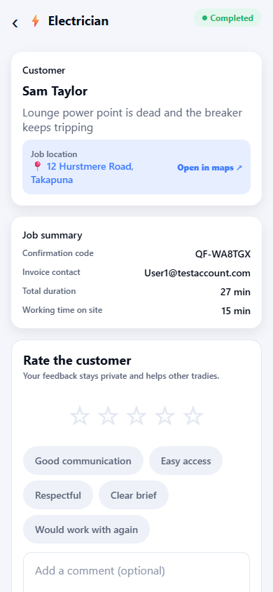
*All done: summary, confirmation code, and the customer rating form.*

---

## 9. Timesheets

The **Timesheets** tab is your automatic job history — every completed job, with the timing evidence you need to invoice.

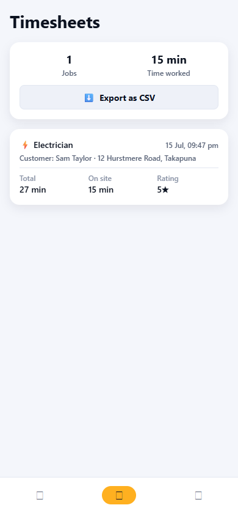
*Timesheets: every completed job with total and on-site durations, ready to export.*

At the top: your **total jobs** and **total time worked**. Each job card shows:

- Trade and completion date/time.
- Customer name and job address.
- **Total** duration (accept → complete) and **On site** duration (arrive → complete).
- The customer's rating of you.
- A **"Contracted to: [Company]"** line on company-sourced jobs.

Tap **⬇️ Export as CSV** to share the full timesheet to email, Drive, or your accounting software — handy at invoicing time and for your records.

> 💡 The on-site duration is captured by the arrival geofence and completion timestamps — an objective record if a customer ever queries the hours on your invoice.

---

## 10. Your profile

The **Profile** tab holds everything that defines how you appear and get dispatched.

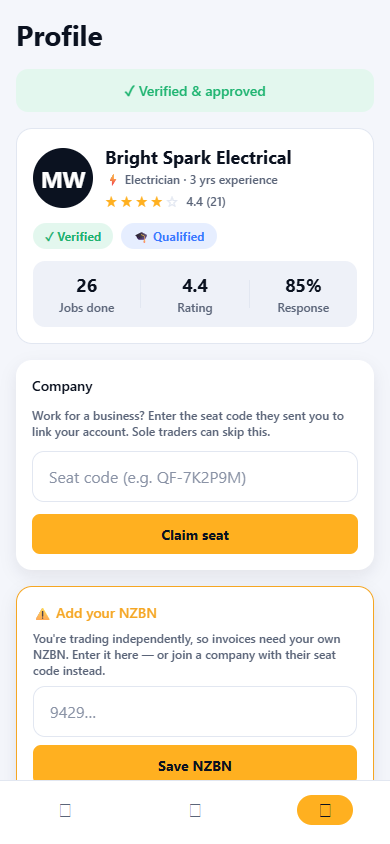
*Profile: approval status, rate card, company seat, agency panels, trades, and service radius.*

### Rate card — required to go live

Your rate card is **shown to customers before they book you** — on your profile in browse-and-choose, and the moment you accept a dispatch job. Independent tradies must set one before going live (the dashboard prompts you until it's done):

| Field | Required? |
|---|---|
| **Hourly rate ($)** | Yes |
| **Call-out fee ($)** | Optional |
| **After-hours call-out ($)** | Optional |

> ⚠️ These are the rates you must honour on the job (Section 12). Keep them current — customers book on the strength of them.

### NZBN

If you trade independently, your invoices need **your own NZBN**. A warning card sits on your Profile until you've saved one (or joined a company). Your saved NZBN shows under Trades & qualifications.

### Joining a COMPANY (seat code)

Work for or with a trades business? They send you a **seat code** (e.g. `QF-7K2P9M`). Enter it under **Company → Claim seat**, then tell the app how you work with them — this changes your identity and billing:

| | **Employee** | **Contractor** |
|---|---|---|
| **You appear as** | Your personal name, trading under the **company's NZBN** and brand | **Your own business name and NZBN** |
| **Rates** | Company rate card (your rate editor is locked 🔒) | Company rates on company work |
| **Invoicing** | Through the company | You **invoice the company** for the work |
| **Company brand** | On your jobs | Only on **company-sourced jobs** |
| **If you leave** | Your own business identity and personal rate card are **restored automatically** | You simply unlink — your identity never changed |

The claim shows **pending** until QuickieFix confirms your details match, then flips to **Verified**. While verified, only the company can remove you from their team; you can leave from your side at any time (**Leave company**).

### Joining a PROPERTY AGENCY panel (agent code)

Property managers run **approved panels** of tradies for their managed rentals. If an agency works with you, they'll give you an **agent code** in the form `QF-AG-XXXX` (e.g. `QF-AG-7K2P`).

1. On your Profile, find **🏢 Property agents**.
2. Enter the code and tap **Join panel**.
3. The request shows **⏳ Pending** until the **agency** confirms you (they know who they invited), then **✓ Approved**.

Once approved, jobs at that agency's managed properties **dispatch straight to you** — steady, recurring maintenance work. Two things to know:

- Panel work runs on the **agency's commercial terms** — rates are agreed with the agency, not the tenant, so **your public rate card is hidden on those jobs**.
- Billing on agency jobs is **locked to the agency** (Section 8) — the tenant never handles the invoice.

### Everything else on the Profile

- **Trades & qualifications** — your primary and secondary trades, licence numbers, expiries, NZBN.
- **Service radius** — switch between 5 / 10 / 15 / 25 km any time.
- **Help & support** — raise a ticket straight to the QuickieFix team.
- **Sign-in & security** — enable biometric unlock.
- **Log out** and **Delete my account** (permanent; completed-job records are kept in de-identified form for billing law).

---

## 11. Money & billing in detail

### The fee, precisely

- **NZ$15.00 flat** per job, charged **only when the job reaches Completed**.
- Viewing, declining, releasing, or being on a cancelled job costs **nothing**.
- No lead fees, no commission, no subscription. GST is not currently added (QuickieFix will show GST separately if/when it becomes GST-registered).

### Free credits

Every newly approved tradie gets **5 free job credits**. Each completed job consumes a credit until they're gone — those jobs show as **free** in the money panel, with your remaining credit count always visible on the dashboard.

### The monthly invoice

- Fees accumulate through the calendar month; the **💳 This month** panel shows the running tally: jobs completed, jobs waived by credit, jobs billable, and the dollar total.
- On the **1st of each month**, QuickieFix emails an invoice for the previous month's billable fees to your **billing email**.
- Pay the invoice off-app (bank transfer per the invoice) — **there is no in-app payment**.

### Company-sourced jobs

If you hold a company seat, **fees for company-sourced jobs bill to the company**, not to you. Jobs you source yourself as a contractor remain on your own account.

### If an invoice goes unpaid

Your account is placed on a **payment hold**: the dashboard shows **"⏸️ Dispatch paused"** and you receive no new jobs. You can still finish any active job. Dispatch resumes automatically as soon as the invoice is settled.

> 💡 Query a fee — say a job was completed by mistake — through **Help & support** on your Profile before the invoice run, and it can be corrected on the invoice.

---

## 12. Rules & standing

QuickieFix works because customers trust what they see. These rules protect that — and your pipeline of work.

### The rules

1. **Honour your displayed rates.** The hourly rate and call-out fee the customer saw when booking are the rates you charge. Changing prices on the doorstep is a breach.
2. **Agree parts & materials on site, before fitting.** Every part on your invoice must have been discussed and accepted by the customer first (Section 8). Surprise charges are the top complaint driver and a removal offence.
3. **Keep your availability honest.** Available means ready to respond. Ignoring offers while Available, or accepting and releasing repeatedly, degrades the customer experience and your dispatch standing.
4. **Keep communication in-app.** Pre-accept messaging is contact-masked for both sides' protection. Don't push customers off-platform to dodge the completion fee — completed work must be completed in the app.
5. **No misrepresentation.** Your trades, licence numbers, qualifications, NZBN, and business identity must be accurate and current. Regulated work (electrical, plumbing, gasfitting, building) may only be done by the appropriately licensed person. Expired or falsified licences mean suspension.
6. **Complete jobs properly.** Use the real arrival and completion flow — the timestamps, confirmation code, and completion record protect you in any dispute.

### Ratings drive dispatch

After every job, the customer rates you (and you rate them). Your average shows on your dashboard, your profile, and to customers browsing tradies. Standing matters mechanically:

- **Higher-rated, reliable tradies are favoured in dispatch** — nearby, available, well-rated tradies see offers in the earliest wave.
- Strong ratings win **browse-and-choose selections**, where customers compare tradies directly.
- 5+ ratings averaging 4.8★ or better earns the 🏆 **Top-rated pro** badge.
- Patterns of complaints, releases, no-shows, or rate breaches lead to reduced dispatch, suspension (**⛔ Suspended** on your Profile), or removal.

> 💡 The formula is boring and it works: keep the toggle honest, turn up when you said, agree every dollar before it's spent, and finish the job in the app. Do that and the ratings — and the job flow — take care of themselves.

---

*QuickieFix · New Zealand · Questions? Raise a ticket via Help & support on your Profile.*
