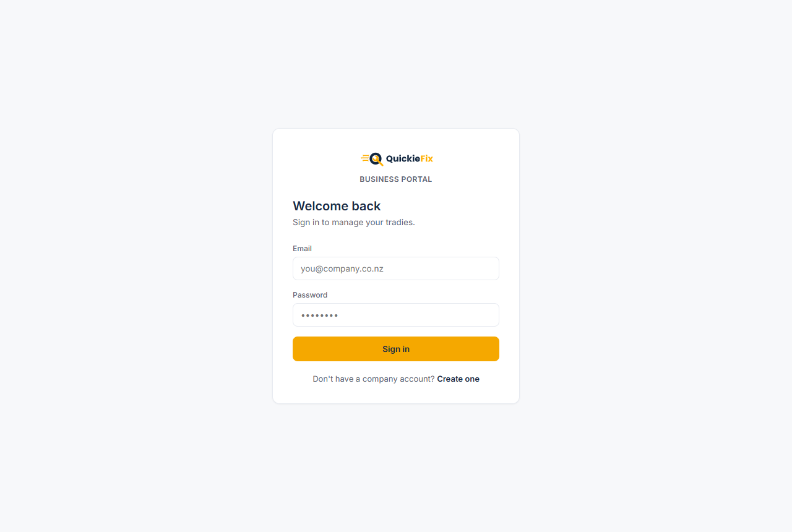
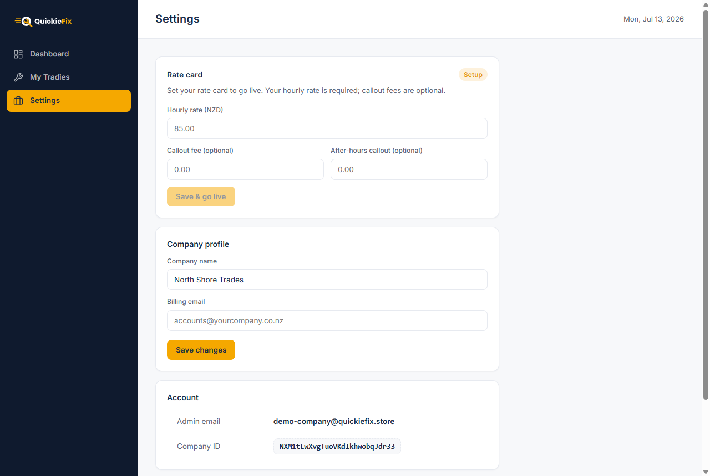
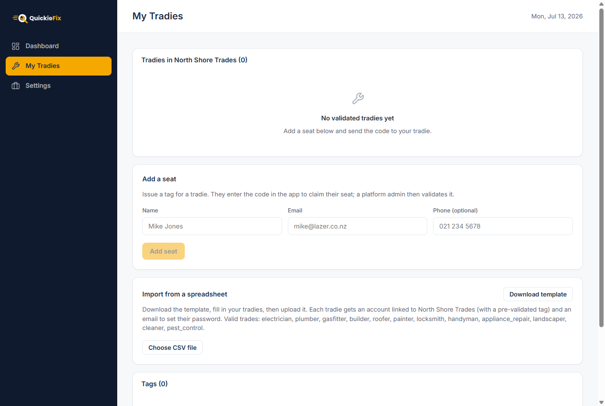
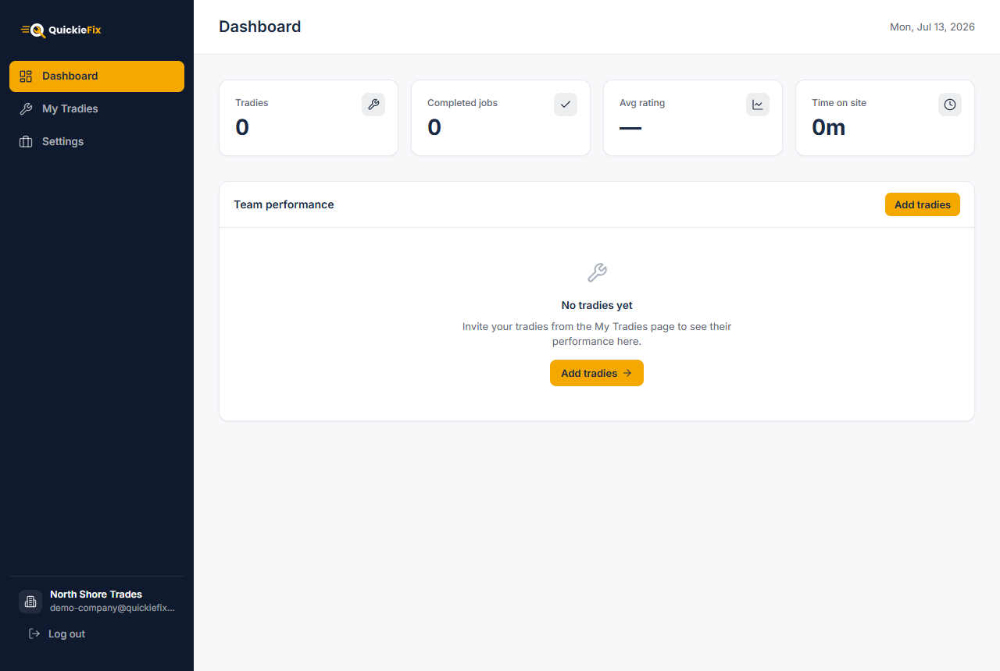

# QuickieFix — Company User Manual

**Run your whole trade team on QuickieFix: one roster, one rate card, one dashboard.**

| | |
|---|---|
| **Applies to** | QuickieFix Business Portal + mobile app v1.2.0 |
| **Audience** | Trade businesses with multiple tradies (owners, ops managers, admins) |
| **Business Portal** | https://portal.quickiefix.app |
| **App download (for your tradies)** | https://quickiefix.app/download |
| **Document version** | 1.0 · July 2026 |

---

## Contents

1. [How the company model works](#1-how-the-company-model-works)
2. [Creating your company](#2-creating-your-company)
3. [Going live: your rate card](#3-going-live-your-rate-card)
4. [Adding tradies one at a time — seats & tag codes](#4-adding-tradies-one-at-a-time--seats--tag-codes)
5. [Adding your whole team at once — CSV import](#5-adding-your-whole-team-at-once--csv-import)
6. [What your tradies experience](#6-what-your-tradies-experience)
7. [Your dashboard: team performance](#7-your-dashboard-team-performance)
8. [Managing the roster: tags, removal, leavers](#8-managing-the-roster-tags-removal-leavers)
9. [Money: rates, fees, shared credits, billing](#9-money-rates-fees-shared-credits-billing)
10. [Company settings](#10-company-settings)
11. [Rules to know](#11-rules-to-know)
12. [Troubleshooting & FAQ](#12-troubleshooting--faq)

---

## 1. How the company model works

QuickieFix uses a **tag model**: the individual tradie is always the unit that gets dispatched, and your company is the **tag** that binds their jobs to your business for branding, rates, reporting and billing.

What that means in practice:

- Your tradies each run the normal QuickieFix app — going available, receiving jobs by proximity/rating, completing on-site.
- Every job a **tagged** tradie accepts is stamped with your company name and **your company rate card** — customers see your business and your prices.
- Their completed jobs, hours and ratings roll up into **your portal dashboard**.
- You control the roster: only you (or QuickieFix) can remove a tradie from your team.

The lifecycle of a seat: **issued → claimed → validated → (removed)**. You issue a tag code; the tradie claims it in the app; QuickieFix validates the identity match; from then on they're on your roster.

---

## 2. Creating your company

1. Open the **Business Portal**: **https://portal.quickiefix.app**

*The Business Portal — sign in or create your company here.*

2. Click **"Create your company"**.
3. Enter: **Company name**, **Your name**, **Email**, **Password** (min 6 characters).
4. Click **Create company**.

You land on your Dashboard. Your company status is **"Setup"** until you save a rate card (next section) — do that first.

Sign back in any time at the same URL with **Sign in**.

---

## 3. Going live: your rate card

**Settings → Rate card.**

| Field | Required | Example |
|---|---|---|
| **Hourly rate (NZD)** | ✅ | 95.00 |
| **Callout fee** | optional | 80.00 |
| **After-hours callout** | optional | 140.00 |

Click **Save & go live**. Your status badge flips from **Setup** (amber) to **Active** (green): *"Rate card saved — you are live."*

*Settings — save your hourly rate to go live.*

**Why this matters:** the company rate card **overrides every tagged tradie's personal rates**. When any of your tradies accepts a job, the customer sees *your* company name and *your* rates, and those rates are snapshotted into the job as the agreed invoice baseline. One price list, no rogue quoting.

---

## 4. Adding tradies one at a time — seats & tag codes

**My Tradies → Add a seat.**

1. Enter the tradie's **Name**, **Email**, and optionally **Phone** — these must match the details they use in the app, because QuickieFix validates the match.
2. Click **Add seat**.
3. A tag code is generated — e.g. **`QF-7K2P9M`** — with a **Copy code** button. **Send this code to the tradie. It expires in 14 days** and is single-use.

**What happens next:**

| Stage | Status badge | Meaning |
|---|---|---|
| You issue the code | 🟡 **issued** | Waiting for the tradie |
| Tradie enters it in the app (Profile → Company → Claim seat) | 🔵 **claimed** | Waiting for QuickieFix validation |
| QuickieFix confirms the name/email/phone match | 🟢 **validated** | On your roster — jobs now carry your brand & rates |
| You remove them | ⚪ **removed** | Seat revoked |

The **Tags** table on the same page shows every code you've ever issued, its status, and actions (**Copy code** for unclaimed ones, **Remove** for active ones).

> The tradie needs their own QuickieFix account first (registered in the app with their trade and licence, and admin-approved). The seat code links that account to your company — it doesn't create the account. To create accounts *for* them, use CSV import below.

*My Tradies — issue seats one at a time, or import your whole team.*

---

## 5. Adding your whole team at once — CSV import

**My Tradies → Import from a spreadsheet** — the fastest way to onboard an existing team:

1. Click **Download template**. Columns:
   `firstName, lastName, email, businessName, primaryTrade, secondaryTrades, yearsExperience, licenceNumber`
   - `primaryTrade` must be one of: electrician, plumber, gasfitter, builder, roofer, painter, locksmith, handyman, appliance_repair, landscaper, cleaner, pest_control
   - `secondaryTrades` is semicolon-separated, e.g. `gasfitter;handyman`
   - Example row: `Mike,Jones,mike@example.com,Lazer Plumbing,plumber,gasfitter;handyman,8,PGDB-12345`
2. Fill it in and click **Choose CSV file**.
3. Review the **preview**: rows are marked **ready** (green) or flagged with issues (red — missing name, invalid email, unknown trade). Fix and re-upload if needed.
4. Click **Import X tradie(s)**.

For each imported tradie, QuickieFix automatically:
- creates their account (with a temporary password),
- issues a **pre-validated tag** (no code-claiming step needed — they're on your roster immediately),
- sends them a branded **welcome email**: *"You've been added to {Your Company} on QuickieFix"* with their credentials and the app download button.

Your tradies just tap the email's download link, log in, and go available.

---

## 6. What your tradies experience

Point your team at the **Tradie User Manual** for day-to-day use. The company-specific differences they'll notice:

- **Profile → Company** shows your business with a **✓ Verified** badge and the note *"Your jobs and rates are managed by this business."*
- **Their rate card is locked** (*Rate card 🔒 — Rates are managed by {Company}*). Their personal rates are kept on file and resume automatically if they ever leave.
- Customers see **your company name** on their accepted jobs.
- Free-job credits: **your shared company pool is consumed before their personal credits**.
- Only you can remove them from the roster — they can't be poached off your seat by accident.

Everything else — availability, wave dispatch, browse & choose, live ETA, completion codes, timesheets — is the standard tradie experience.

---

## 7. Your dashboard: team performance

**Dashboard** gives you the trading picture at a glance:

**KPI cards:** Tradies · Completed jobs · Avg rating · Time on site (aggregate)

**Team performance table** — one row per tradie:

| Column | Shows |
|---|---|
| Tradie | Name + business name |
| Trade | Primary trade |
| Jobs | Completed count |
| Rating | ★ average |
| Time on site | Total billable-style hours |
| Status | Approval badge |

**Click any row** for the tradie's detail page: KPIs, complete **job history** (customer, address, completion date, on-site duration, rating per job) and their **customer reviews** verbatim — your quality-control view.

*Your Dashboard — team KPIs at a glance.*

---

## 8. Managing the roster: tags, removal, leavers

- **Roster** = every tradie with a **validated** tag, listed under *"Tradies in {Company}"*.
- **Removing someone**: My Tradies → Tags table → **Remove** → confirm. Their tag becomes *removed*; from that moment new jobs no longer carry your brand or rates (their personal rate card resumes).
- **History is preserved**: jobs completed while tagged remain stamped with your company forever — removal never rewrites the past. Their historical performance stays visible in your reporting.
- **Expired codes**: unclaimed codes die after 14 days — just issue a fresh seat.

---

## 9. Money: rates, fees, shared credits, billing

| Concept | How it works |
|---|---|
| **Customer invoicing** | Your tradies' jobs carry **your rate card**. The customer is invoiced **by your business directly** — QuickieFix processes no payment. Every completed job generates a `QF-XXXXXX` confirmation code emailed to the customer with the rate snapshot; put it on your invoice as the shared reference. |
| **Platform fee** | A small flat fee per completed job ($15) — charged per tradie, invoiced monthly on the 1st, off-app, 7-day terms. |
| **Shared credits** | Your company can hold a **shared pool of free-job credits** — consumed before any tradie's personal credits, so early jobs cost nothing. Ask QuickieFix to load your pool. |
| **Non-payment** | Sustained non-payment leads to a dispatch hold on the affected tradies until settled. |

---

## 10. Company settings

**Settings** page:

- **Rate card** — update any time; new rates apply to *future* acceptances (in-flight jobs keep the rate snapshotted at their confirmation).
- **Company profile** — company name and **billing email** (where your platform invoices go, e.g. `accounts@yourcompany.co.nz`).
- **Account** — your admin email and Company ID (quote it in support requests).
- **Log out**.

---

## 11. Rules to know

- **No rate card = not live.** Set the hourly rate first; everything else follows.
- **Tag codes are single-use and expire in 14 days.**
- **Name/email must match** between the seat you issue and the tradie's app account — that's what validation checks.
- **Company rates override personal rates** for tagged tradies; the override ends when the tag is removed.
- **Job history is immutable** — completed jobs stay stamped with the company that held the tag at acceptance.
- **Shared credits before personal credits.**

---

## 12. Troubleshooting & FAQ

**My tradie claimed the code but still isn't on the roster.**
Claimed seats need a one-time QuickieFix validation (identity match). It shows as *Pending verification* in their app and 🔵 *claimed* in your Tags table until then. If it's stuck, check the name/email you issued matches their account exactly.

**The code expired before they used it.**
Issue a new seat — codes are throwaway.

**A tradie left the company.**
Tags table → **Remove**. Past jobs stay yours; future jobs are theirs alone.

**Can a tradie be on two companies?**
No — one active tag per tradie.

**Can I set different rates per tradie?**
Not within one company — the company rate card is uniform (that's the point). Genuinely different pricing tiers would be separate companies.

**Where do I see what we owe QuickieFix?**
Each tradie's dashboard shows their month ("💳 This month"); the consolidated invoice arrives monthly at your billing email. Fees are flat per completed job, credits are burned first.

**My import flagged rows as "Unknown trade".**
The `primaryTrade` column must use the exact keys listed in section 5 (lowercase, underscores — e.g. `appliance_repair`).

---

*QuickieFix · On-demand, verified tradies · quickiefix.app*
