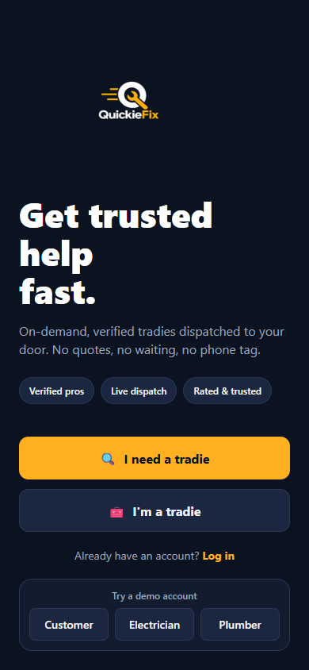
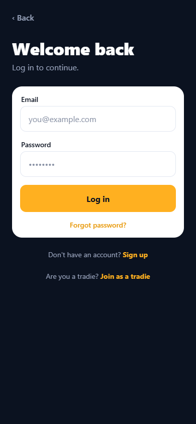
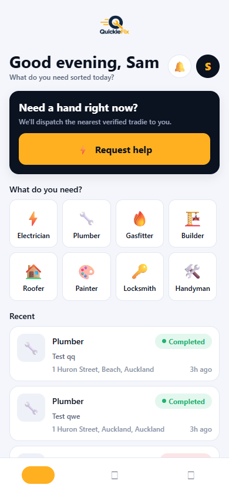
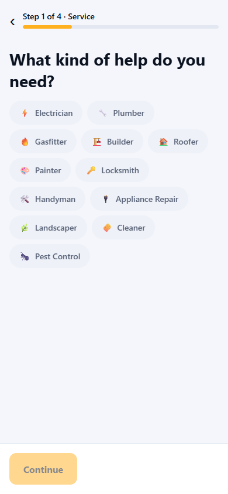
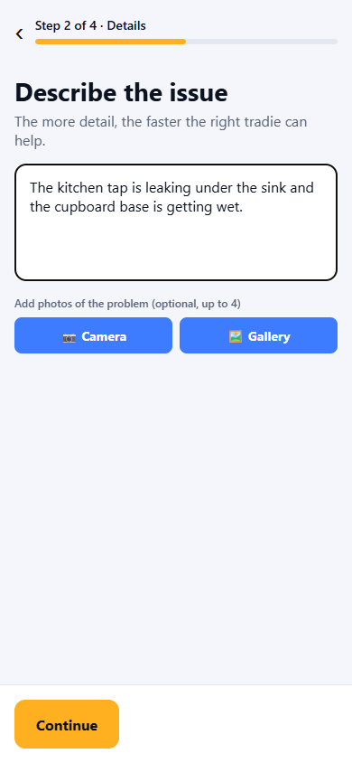
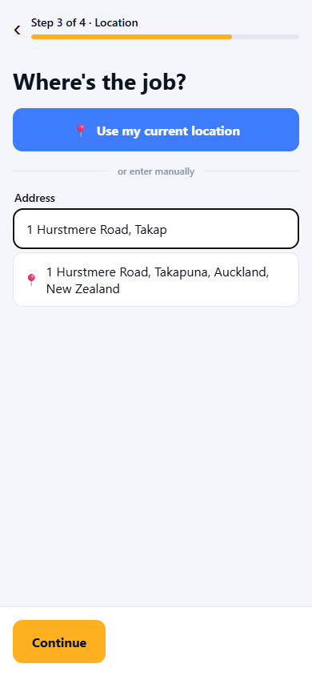
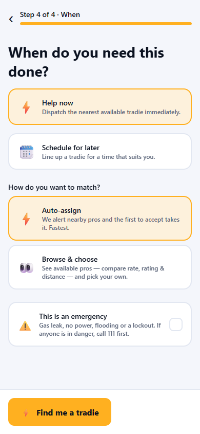

# QuickieFix — Customer User Manual

**On-demand, verified tradies dispatched to your door.**

| | |
|---|---|
| **Applies to** | QuickieFix mobile app v1.2.0 (Android) and the web app |
| **Audience** | Customers requesting trade services |
| **Get the app** | https://quickiefix.store/download |
| **Web app** | https://quickiefix-app.web.app |
| **Website** | https://quickiefix.store |
| **Document version** | 1.0 · July 2026 |

---

## Contents

1. [What QuickieFix does](#1-what-quickiefix-does)
2. [Installing and signing up](#2-installing-and-signing-up)
3. [Signing in, security and biometrics](#3-signing-in-security-and-biometrics)
4. [Your home screen](#4-your-home-screen)
5. [Requesting a tradie — step by step](#5-requesting-a-tradie--step-by-step)
6. [Auto-assign vs Browse & choose](#6-auto-assign-vs-browse--choose)
7. [Emergencies](#7-emergencies)
8. [Tracking your job](#8-tracking-your-job)
9. [Messaging your tradie](#9-messaging-your-tradie)
10. [Job completion, your confirmation code and invoicing](#10-job-completion-your-confirmation-code-and-invoicing)
11. [Ratings and reporting a problem](#11-ratings-and-reporting-a-problem)
12. [Your account](#12-your-account)
13. [Notifications and emails you'll receive](#13-notifications-and-emails-youll-receive)
14. [Privacy and data retention](#14-privacy-and-data-retention)
15. [Rules to know](#15-rules-to-know)
16. [Troubleshooting & FAQ](#16-troubleshooting--faq)

---

## 1. What QuickieFix does

QuickieFix connects you with **verified, licensed tradies** in minutes — no quotes, no waiting, no phone tag. You describe the problem, we alert the closest available pros, and you watch your tradie travel to your door in real time.

**Trades available:** ⚡ Electrician · 🔧 Plumber · 🔥 Gasfitter · 🏗️ Builder · 🏠 Roofer · 🎨 Painter · 🔑 Locksmith · 🛠️ Handyman · 🔌 Appliance Repair · 🌿 Landscaper · 🧽 Cleaner · 🐜 Pest Control

Every tradie on the platform is admin-verified before they can receive a single job. Regulated trades (electricians, plumbers, gasfitters, builders) must hold a valid licence.

> **QuickieFix is not an emergency service.** If there is a fire, a gas leak you can smell, risk of electrocution, or any danger to life — **call 111 first**.

---

## 2. Installing and signing up

### Android

1. On your phone, open **https://quickiefix.store/download** — this always serves the newest version.
2. Tap the downloaded file and allow the installation when prompted.
3. Open **QuickieFix**.

### Web (laptop or desktop)

Open **https://quickiefix-app.web.app** in any modern browser. The web app mirrors the phone app.

### Creating your account

1. On the welcome screen ("**Get trusted help fast.**"), tap **🔍 I need a tradie**.
2. Fill in your **first name, last name, email and a password** (minimum 6 characters).
3. Tap **Create account**. You're in — no approval wait for customers.

Already registered? Tap **Already have an account? Log in**.

*The welcome screen — start here.*

---

## 3. Signing in, security and biometrics

- **Log in** with your email and password. Forgot it? Tap **Forgot password?** — a branded reset email arrives with a **Reset my password** button.
- **The app signs you out whenever it is fully closed** (banking-style security). Returning users land straight on the login page.
- **Fingerprint / face unlock:** turn on **Biometric unlock** in your **Account** tab. From then on, opening the app shows a lock screen — one scan and you're back in, no password typing. You can always tap **Use password instead**.
- Briefly hopping to another app (e.g. Maps) and back within a minute never signs you out.

*The login screen — with sign-up and tradie links below.*

---

## 4. Your home screen

From top to bottom:

| Element | What it does |
|---|---|
| **QuickieFix logo** | Brand header |
| **Greeting** ("Good morning, Sam") | With "What do you need sorted today?" |
| **🔔 Bell** | Badge shows your active jobs; tap for your Activity list |
| **Avatar** | Opens your Account tab |
| **⚡ Request in progress banner** | Appears when a job is live — **Continue** to track it or **Cancel** |
| **"Need a hand right now?" card** | **⚡ Request help** starts a new request |
| **What do you need?** | Trade tiles — tap one to start a request with that trade pre-selected |
| **Recent** | Your last completed/cancelled jobs |

Bottom tabs: **Home · Activity · Account**.

*Your home screen: request button, trade tiles and recent jobs.*

---

## 5. Requesting a tradie — step by step

Tap **⚡ Request help** (or a trade tile). The wizard has **4 steps** with a progress bar.

### Step 1 — Service
Pick the trade you need. Tap **Continue**.

*Step 1 — all twelve trades.*

### Step 2 — Details & photos
1. Describe the issue (at least 5 characters). *Example: "My hot water cylinder is leaking in the garage."* The more detail, the faster the right tradie can help.
2. **Add up to 4 photos** (optional but highly recommended): tap **📷 Camera** to take one or **🖼️ Gallery** to attach existing photos. Remove a photo with the small ✕ on its corner. Tradies see your photos before deciding — good photos get faster, better-matched responses.

*Step 2 — description plus camera/gallery photo buttons.*

### Step 3 — Location
Three ways to set the address:

- **Your properties** (if you've added any — see the Property Manager manual): tap the property and the address fills itself.
- **📍 Use my current location** — GPS pins your exact position.
- **Type the address** — after 3 characters, live **address suggestions** appear (New Zealand addresses only). Pick one and you'll see **"✓ Location pinned — tradies see exact distance"**: your job now carries exact coordinates, which means accurate distance ranking, accurate ETAs and a working map.

*Step 3 — start typing and pick from live NZ address suggestions.*

### Step 4 — When & matching
- **⚡ Help now** or **🗓️ Schedule for later**.
- **How do you want to match?** — see section 6.
- **⚠️ This is an emergency** — see section 7.

Tap **⚡ Find me a tradie** (auto) or **👀 Browse tradies** (browse) to submit.

*Step 4 — urgency, matching mode and the emergency option.*

> **Leaving mid-request?** The app warns you: *"Discard this request?"* so a half-filled form is never lost by accident.

---

## 6. Auto-assign vs Browse & choose

| | **⚡ Auto-assign** (default) | **👀 Browse & choose** |
|---|---|---|
| **How it works** | We alert nearby pros; the **first to accept takes the job** | You see a live list of available pros and **pick your own** |
| **Speed** | Fastest | You control the pace |
| **Who is alerted** | The nearest 3 tradies first, widening to 8, then all (so the closest get first shot) | Available tradies appear automatically; busy tradies are invited and appear if they opt in |
| **What you compare** | Nothing to do — sit back | **Rate, star rating, jobs completed and distance** per tradie |
| **Locking in** | First accept = locked in. You're notified: "✅ Tradie found!" | You tap **Choose this tradie** → they get a final accept prompt → locked in |

**In Browse mode:**
- The list is sorted nearest-first. Each card shows the business name, rating, completed jobs, distance/ETA and hourly rate.
- Tradies who put their hand up show a **"responded"** badge; you'll also get a push: *"👀 A tradie is keen on your job"*.
- Tradies can **ask you questions** before you choose — a *"💬 … asked you a question"* banner appears at the top; answer right there, or tap **View tradie** to see their profile.
- Until *you* choose, **no tradie can take your job** — they can only express interest.
- If your pick declines, you're back at the list to choose someone else.

---

## 7. Emergencies

Tick **⚠️ This is an emergency** for gas leaks, no power, flooding or lockouts.

- A safety banner appears: **"Is anyone in danger?"** with a **📞 Call 111 now** button. QuickieFix is not an emergency service.
- Emergencies are **always auto-assigned** (browse is disabled — no time to shop around).
- Tradies receive a distinct **🚨 Emergency job** alert.

---

## 8. Tracking your job

Submitting takes you straight to the live tracking screen. What you'll see, in order:

1. **Finding you a tradie** — a live search card. Watch the search widen: *"Alerting the closest pros…" → "Widening the search…" → "Reaching every nearby pro…"*. Most jobs match within a few minutes. If genuinely no one is available, you'll see **"No tradie found"** with a **Try again** button — our team is also alerted.
2. **✅ Confirmed** — your tradie is locked in. You'll see their **profile card** (rating, completed jobs, licence badge) and the **rates that now apply** — the hourly rate and any call-out fee are snapshotted at this moment and can't change mid-job.
3. **🚗 On the way** — the banner shows **"📍 Live · 3.2 km away · arriving in about 8 min"**, tracking the tradie's actual phone as they drive. The map shows your address pin and an **amber dot** moving toward it (Uber-style). Distances/ETAs update as they move.
4. **🛠️ On site** — they've arrived and are working. Arrival is detected automatically by GPS.
5. **✅ Completed** — see section 10.

**Your request card** (description, address, photos) and a **progress timeline** with timestamps sit at the bottom of the screen.

**Cancelling:** tap **Cancel job** any time before completion. The tradie is notified.

---

## 9. Messaging your tradie

- Tap the **💬 icon** in the tracking screen header to open the job's **message centre** — the job description and photos sit at the top for context, the conversation below.
- **Before a tradie is assigned** (browse mode), candidates can ask you questions and you can answer — it's the same thread.
- **Contact details are masked**: phone numbers, emails and social handles are automatically hidden in messages, for everyone's safety. Keep it on QuickieFix.
- **🧹 Messages are deleted automatically when the job closes** (completed or cancelled). Photos are deleted 24 hours after the job ends.

---

## 10. Job completion, your confirmation code and invoicing

When the work is done, the tradie completes the job **with you present**:

1. They confirm the **invoice contact name and email** with you (prefilled from your account — correct it on the spot if the invoice should go elsewhere, e.g. to your landlord or office).
2. The moment they mark it complete, QuickieFix generates a unique **confirmation code — format `QF-XXXXXX`** — created by our servers and impossible for anyone to alter.
3. You receive a **completion record email** with the code and the **exact rates that applied** (hourly rate, call-out fee).

**How payment works:** QuickieFix takes no payment in the app. **The tradie invoices you directly** at the rates you saw when they were confirmed. Quote the `QF-` code on any invoice query — it's your shared, tamper-proof record of the job.

The tracking screen also shows a **job summary**: total time, time on site, and the code.

---

## 11. Ratings and reporting a problem

- After completion, rate your tradie: **1–5 stars** plus quick tags (*Professional, Friendly, On time, Excellent workmanship, Would recommend*) and an optional review. Ratings keep the platform honest — they're aggregated by our servers and can't be faked.
- The tradie rates you too (privately) on things like communication and access.
- Something wrong? Tap **Report a problem** on the completed job, enter a subject and the details, and **Submit complaint**. Our team reviews every complaint and will be in touch.

---

## 12. Your account

**Account** tab, from top to bottom:

- **Profile** — your name, email and request/completed counts.
- **Saved addresses** — home and work.
- **🏠 Properties** — landlord features: add properties, link tenants, see jobs at your properties. Covered fully in the *Property Manager & Landlord User Manual*.
- **Biometric unlock** — fingerprint/face sign-in toggle.
- **Log out** — signs out fully and stops notifications to this device.

*The Account tab — profile, addresses, properties and security.*

---

## 13. Notifications and emails you'll receive

| Event | Notification |
|---|---|
| A tradie expressed interest (browse) | 👀 *"A tradie is keen on your job"* |
| Tradie locked in | ✅ *"Tradie found! … will head over shortly"* |
| Tradie sets off | 🚗 *"On the way"* |
| Job completed | 📧 Completion record email with your `QF-` code and rates |
| Password reset requested | 📧 Reset email with a secure link |

Tapping any job notification opens the job directly. Notification badges clear automatically when you open the app.

---

## 14. Privacy and data retention

| Data | Policy |
|---|---|
| **Messages** | Deleted automatically the moment a job completes or is cancelled |
| **Job photos** | Deleted automatically 24 hours after the job ends |
| **Your exact address** | Shown to a tradie **only once the job is theirs**. Before that, candidates see only the suburb/area and rough distance |
| **Contact details in chat** | Automatically masked |
| **Completion codes & job records** | Kept permanently as your invoice reference |
| **Rates** | Snapshotted at confirmation — cannot change mid-job |

---

## 15. Rules to know

- **One live job per trade.** You can't have two plumbing jobs running at once — track or cancel the current one first. You *can* run a plumbing job and an electrical job side by side.
- **Emergencies are always auto-assigned.**
- **Rates are locked at confirmation.** What you saw is what applies.
- **The app signs out when fully closed.** Turn on biometrics for one-touch return.

---

## 16. Troubleshooting & FAQ

**The search is taking a while.**
The search widens automatically — nearest 3 pros first, then 8, then everyone in range. Most jobs match in minutes. If no one accepts, you'll be told clearly and can retry.

**Can I choose a specific tradie?**
Yes — pick **👀 Browse & choose** in Step 4. Not available for emergencies.

**Why can't I create a second plumbing job?**
One live job per trade. Finish or cancel the current plumbing job first (other trades are unaffected).

**Why can't I see the tradie's phone number?**
All contact stays in-app until a job is confirmed — messages are masked to protect both sides. Once the tradie is assigned and en route, you can coordinate through the in-app chat.

**I was asked for my fingerprint twice / the app logged me out.**
Fully closing the app ends the session by design. Enable **Biometric unlock** in Account for one-scan re-entry.

**Where's my invoice?**
The tradie invoices you directly. Your completion email contains the rates and your `QF-` confirmation code — quote it in any query.

**The map isn't showing.**
The embedded map needs app version 1.2.0 or later — update via https://quickiefix.store/download.

---

*QuickieFix · On-demand, verified tradies · quickiefix.store*
