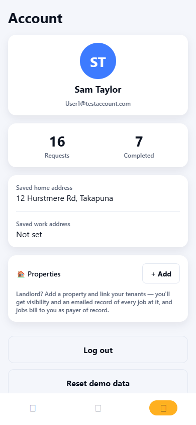

# QuickieFix — Property Manager & Landlord User Manual

**Every job at every property: dispatched in minutes, documented automatically.**

| | |
|---|---|
| **Applies to** | QuickieFix mobile app v1.2.0 (Android) and the web app |
| **Audience** | Landlords, property managers and their tenants |
| **Get the app** | https://quickiefix.store/download |
| **Web app** | https://quickiefix-app.web.app |
| **Document version** | 1.0 · July 2026 |

---

## Contents

1. [How QuickieFix works for property people](#1-how-quickiefix-works-for-property-people)
2. [Getting started](#2-getting-started)
3. [Adding your properties](#3-adding-your-properties)
4. [Linking tenants](#4-linking-tenants)
5. [Requesting work at a property](#5-requesting-work-at-a-property)
6. [When a tenant requests work](#6-when-a-tenant-requests-work)
7. [Your paper trail: automatic property emails](#7-your-paper-trail-automatic-property-emails)
8. [Payer of record and invoicing](#8-payer-of-record-and-invoicing)
9. [Monitoring jobs at your properties](#9-monitoring-jobs-at-your-properties)
10. [The tenant experience](#10-the-tenant-experience)
11. [Managing a portfolio](#11-managing-a-portfolio)
12. [Privacy and data retention](#12-privacy-and-data-retention)
13. [Troubleshooting & FAQ](#13-troubleshooting--faq)

---

## 1. How QuickieFix works for property people

As a landlord or property manager you get three things ordinary maintenance phone-arounds never give you:

1. **Speed** — verified tradies dispatched to the property in minutes, chosen by proximity and rating, never by who answers the phone.
2. **Visibility** — you're **emailed automatically** when a job is requested at your property and again when it completes, with the full record: what, who, when, how long, and how it was rated.
3. **A clean paper trail** — every completed job carries a server-generated confirmation code (`QF-XXXXXX`) and a rate snapshot, giving you a tamper-proof reference for every invoice.

Tenants can raise issues themselves at properties you link them to — you stay informed without being the middleman at 10 pm.

> All customer-side features (requesting, tracking, messaging, ratings) work exactly as described in the **Customer User Manual** — this manual covers what's *additional* for property owners.

---

## 2. Getting started

1. Install the app from **https://quickiefix.store/download** (or use the web app).
2. Create a standard account: **🔍 I need a tradie** → name, email, password. There is no separate "landlord account" — property features live inside every customer account.
3. Open the **Account** tab. Everything property-related happens in the **🏠 Properties** section.

*The Account tab — the 🏠 Properties section is your property hub.*

---

## 3. Adding your properties

In **Account → 🏠 Properties**:

1. Tap **+ Add**.
2. **Label (optional)** — how you know it, e.g. *"Unit 4, Takapuna"*.
3. **Address** — the full street address.
4. Tap **Add property**.

Repeat for every property in your portfolio. Each property card shows its label, address, and how many tenants are linked.

---

## 4. Linking tenants

Linking a tenant does two things: the property appears in **their** app as a one-tap job location, and **you** get automatic visibility of every job they raise there.

1. Ask your tenant to create a free QuickieFix account (they just need the app and an email).
2. On the property card, enter their account email in **"Tenant's QuickieFix email"**.
3. Tap **Link tenant**.

The tenant now sees the property in their app marked *"You're a tenant here · managed by {your name}"*. Unlink any tenant at any time with the **Unlink** button next to their email.

> **Tip:** link tenants the day the tenancy starts — it takes 30 seconds and every future maintenance issue then documents itself.

---

## 5. Requesting work at a property

Request exactly as a normal customer (**⚡ Request help**), with one difference at **Step 3 — Location**:

- A **"For one of your properties?"** picker appears above the address field, listing all your properties.
- Tap the property — the address (and its exact coordinates) fill automatically.

Then choose your matching mode as usual:
- **⚡ Auto-assign** — nearest available pro, first to accept.
- **👀 Browse & choose** — compare rates, ratings and distance, pick your own. Ideal for non-urgent maintenance where you want control over who enters your property.

Everything else — photos (add up to 4; highly recommended for maintenance triage), live tracking, messaging, completion codes — works exactly as in the Customer manual.

---

## 6. When a tenant requests work

A linked tenant simply opens their own app, taps **Request help**, and picks the property from *their* location step. From that moment:

- The job is **stamped with the property and with you as payer of record**.
- You are **emailed immediately**: *"New job requested at your property"* — property, service, the tenant's description of the issue, and live status.
- Dispatch proceeds instantly — no approval bottleneck in the middle of a burst pipe. (You'll always know, because the email arrives the moment the request is made.)
- When the job completes you receive the **completion email** with the full record.

---

## 7. Your paper trail: automatic property emails

Two branded emails per job, no action required:

**📧 "New job requested at your property"** — sent the moment a job is raised:

| Field | Content |
|---|---|
| Property | Address (and your label) |
| Service | Trade requested |
| Issue | The requester's description |
| Status | Live status at time of sending |

**📧 "Job complete at your property"** — sent at completion, adding:

| Field | Content |
|---|---|
| Tradie | Business that did the work |
| Accepted / On site / Completed | Timestamps |
| Customer rating | The star rating given |

Together with the completion record (code + rates), this is a per-property maintenance history you never have to compile by hand.

---

## 8. Payer of record and invoicing

- Jobs at your linked properties are stamped with **you as payer of record**.
- QuickieFix processes no payment — **the tradie invoices directly** at the rates snapshotted when they were confirmed.
- At completion, the tradie confirms the **invoice contact name and email** on-site. For tenant-raised jobs, tenants should give **your** billing details here — brief them once, and the invoice comes straight to you along with the `QF-` confirmation code.
- Quote the `QF-XXXXXX` code in any invoice query — it's the shared, tamper-proof record.

---

## 9. Monitoring jobs at your properties

In **Account → Properties → "Jobs at your properties"**, you'll see the recent jobs across your portfolio at a glance — trade, address and live status. Tap through any job you raised yourself for full live tracking. Tenant-raised jobs keep you informed via the email trail.

---

## 10. The tenant experience

What your tenants see:

- The property appears in their **Account → Properties** as *"You're a tenant here · managed by {landlord name}"*.
- When they request help, the property is offered as a one-tap location.
- They get the full customer experience: photos, live tradie tracking, in-app masked messaging, and the completion record.
- They **cannot** add/remove tenants or see your other properties.

A one-line brief for new tenants works well: *"Anything broken? Use QuickieFix, pick the flat as the location, and put my email as the invoice contact when the job's done."*

---

## 11. Managing a portfolio

- **Label consistently** (*"12A Ponsonby Rd — front flat"*) — labels appear on property cards and in tenant apps.
- **One property = one card**, each with its own tenant links.
- Property-management companies with many units can run all properties under one QuickieFix account, or one account per portfolio manager — links and emails follow the account that owns the property.
- **Browse & choose + the message thread** is your vetting tool: ask a tradie about their approach before choosing them for sensitive properties. Note that pre-assignment messages are cleared when the job closes (see below), so record anything contractual in the invoice conversation instead.

---

## 12. Privacy and data retention

| Data | Policy |
|---|---|
| **Property emails** | Yours to keep — they're the durable record |
| **Completion codes / job records** | Permanent |
| **In-app messages** | Deleted automatically when the job closes |
| **Job photos** | Deleted automatically 24 hours after the job ends — save any photos you need for records when the completion email arrives |
| **Exact address** | Revealed to a tradie only once the job is theirs; candidates see suburb-only |
| **Tenant contact details** | Masked in all in-app messages |

---

## 13. Troubleshooting & FAQ

**My tenant can't see the property.**
The link is by their **QuickieFix account email** — confirm they registered with the exact email you linked, and that they're signed in. Re-link with the correct address if needed.

**Can a tenant approve/see my other properties?**
No. Tenants see only properties they're linked to, and only as a job location.

**Do tenant jobs need my approval before dispatch?**
No — dispatch is immediate (a burst pipe can't wait for email tennis). You're notified the moment the request is made.

**Who pays the tradie?**
Whoever's details are confirmed as the invoice contact at completion. Brief tenants to enter your billing email; the job is stamped with you as payer of record either way.

**Can I get the emails to a different address?**
Property emails go to your account email. Use your property-management inbox as your account email if you want the trail landing there.

**A job went badly — what's my recourse?**
Open the job → **Report a problem**. Complaints go straight to the QuickieFix operations team and are tracked to resolution. Have the `QF-` code handy.

---

*QuickieFix · On-demand, verified tradies · quickiefix.store*
