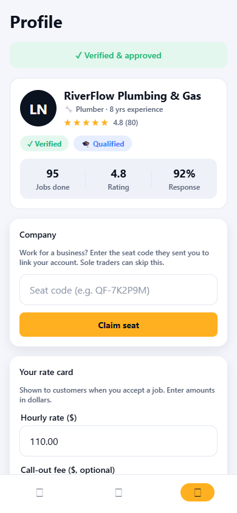
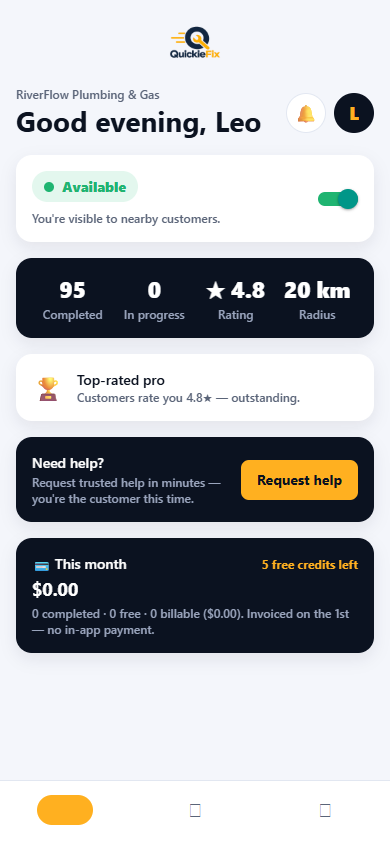
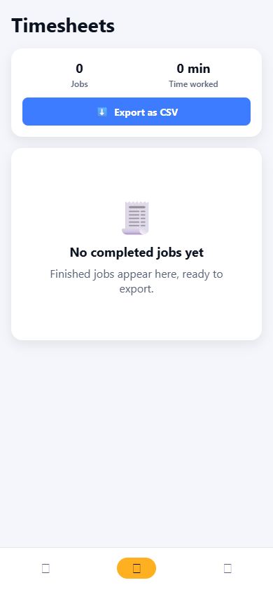

# QuickieFix — Tradie User Manual

**Jobs come to you. No quoting, no chasing, no phone tag.**

| | |
|---|---|
| **Applies to** | QuickieFix mobile app v1.2.0 (Android) and the web app |
| **Audience** | Tradies — sole traders and company-tagged team members |
| **Get the app** | https://quickiefix.store/download |
| **Web app** | https://quickiefix-app.web.app |
| **Document version** | 1.0 · July 2026 |

---

## Contents

1. [How QuickieFix works for tradies](#1-how-quickiefix-works-for-tradies)
2. [Registering and getting approved](#2-registering-and-getting-approved)
3. [Signing in, security and biometrics](#3-signing-in-security-and-biometrics)
4. [Setting up your profile](#4-setting-up-your-profile)
5. [Your dashboard](#5-your-dashboard)
6. [Going available and how dispatch finds you](#6-going-available-and-how-dispatch-finds-you)
7. [Receiving and accepting jobs — Auto-assign](#7-receiving-and-accepting-jobs--auto-assign)
8. [Browse & choose jobs — getting picked](#8-browse--choose-jobs--getting-picked)
9. [Doing the job: travel, arrival, completion](#9-doing-the-job-travel-arrival-completion)
10. [The completion code and getting paid](#10-the-completion-code-and-getting-paid)
11. [Messaging customers](#11-messaging-customers)
12. [Ratings](#12-ratings)
13. [Timesheets](#13-timesheets)
14. [Money: fees, free credits, invoicing](#14-money-fees-free-credits-invoicing)
15. [Working under a company](#15-working-under-a-company)
16. [Notifications you'll receive](#16-notifications-youll-receive)
17. [Rules to know](#17-rules-to-know)
18. [Troubleshooting & FAQ](#18-troubleshooting--faq)

---

## 1. How QuickieFix works for tradies

Customers request help; QuickieFix alerts the **closest available, verified tradies**. You accept on your phone, navigate with your own maps app, do the work, and complete the job on-site. The customer pays you **directly on your rates** — QuickieFix never touches the money. Your only cost is a small per-job platform fee, invoiced monthly.

**Matching is ranked by proximity, then rating, then response rate — never by price.** Being close, rated well and quick to respond gets you more work.

---

## 2. Registering and getting approved

1. Open the app → **🧰 I'm a tradie** (or from the login page: *"Are you a tradie? Join as a tradie"*).
2. Complete the application:
   - **Personal** — name, email, password (min 6 characters).
   - **Business** — business name (required), trading name, years of experience, NZBN (optional).
   - **Primary trade** — pick one of the 12 trades.
   - **Secondary trades (optional)** — every extra trade you're competent in **gets you dispatched for those jobs too**. A plumber who lists gasfitting receives gasfitter jobs.
   - **Licence** — regulated trades (⚡ electrician, 🔧 plumber, 🔥 gasfitter, 🏗️ builder) must supply a licence number (e.g. `EWRB-104882`). Certificate & insurance uploads are requested during review.
   - **Service radius** — 5 / 10 / 15 / 25 km. You're only offered jobs inside this radius.
3. Tap **Submit application**.

Your account is **⏳ pending until an admin verifies your details** — you'll see a banner on the dashboard until then. Once approved: **✓ Verified & approved**.

> **Joining through your company?** If your company added you, you'll instead receive a **welcome email** with a temporary password and the download link — see section 15.

---

## 3. Signing in, security and biometrics

- The app **signs you out whenever it's fully closed** (banking-style). Enable **Biometric unlock** in your **Profile** tab for one-scan re-entry.
- **Important for job flow:** closing the app does **not** take you off the market. If you're available, **job offers still reach your phone as push notifications** — tapping one opens the job ready to accept. Only tapping **Log out** stops notifications to your device.
- Quick hops to Maps and back never sign you out.

---

## 4. Setting up your profile

**Profile** tab — complete this before going available:

- **Rate card** *(required for independents)* — hourly rate, optional call-out fee, optional after-hours call-out. **Customers see these rates the moment you're confirmed**, and they're snapshotted per job as the agreed baseline. No rate card = customers see no pricing = fewer picks.
- **Trades & qualifications** — primary/secondary trades, licence numbers, NZBN.
- **Service radius** — change any time (5/10/15/25 km).
- **Company** — claim a seat code if you work for a business (section 15).
- **Biometric unlock** toggle.

*The Profile tab — approval status, company, rate card and qualifications.*

---

## 5. Your dashboard

Top to bottom:

| Section | What it shows |
|---|---|
| **Greeting + 🔔 bell** | Badge = pending offers + selections + browse requests |
| **Availability card** | Your on/off switch — see section 6 |
| **Operational summary** | Completed · In progress · ★ Rating · Radius, plus "Last completed…" |
| **Performance banner** | 🚀 Ready to earn → ⭐ streaks → 🏆 Top-rated pro (4.8★+, 5+ ratings) |
| **Active job card** | Your current job — tap to manage |
| **"You've been selected"** | Browse-mode customers who **chose you** — accept or decline |
| **"Customers looking for you"** | Browse-mode jobs where the customer is choosing — put your hand up |
| **Need help?** | You can request a tradie yourself — you're the customer this time |
| **💳 This month** | Fees, free credits, billable total (section 14) |

A loud **amber banner** also drops over any screen when a new request lands — with a buzz and a chime.

*The dashboard: availability switch, summary stats, performance banner and the month's money panel.*

---

## 6. Going available and how dispatch finds you

Flip the **availability toggle** to **🟢 Available — accepting jobs**.

- Going available captures your **phone's GPS position** — distance ranking, browse-list distances and customer ETAs are measured from **where you actually are**, not your office. Your position refreshes automatically whenever you open the app while available.
- **Wave dispatch (auto jobs):** a new job alerts the **nearest 3** available tradies first; after 90 seconds it widens to 8; after 3 minutes, everyone in radius. Closest gets first shot — respond fast.
- You will **not** receive offers while: offline, pending approval, on a payment hold, or already on an active job.

---

## 7. Receiving and accepting jobs — Auto-assign

1. **The alert**: push notification — *"⚡ New plumber job — Sam"* with the job description and **suburb** (exact addresses are never shown before a job is yours). Emergency jobs arrive as **🚨 Emergency**.
2. Tap it (or the in-app banner) to open the **job offer screen**: customer's first name, full description, **photos**, the **area + distance** (e.g. *"📍 Takapuna, Auckland · ~2.1 km from you"*), and the message thread to **ask a question before accepting**.
3. **⚡ First to accept is locked in.** Tap **Accept job** — you get the job immediately, no further confirmation step. The customer is told you're on the way.
4. Not interested? **Decline** — the job instantly moves to the next nearest tradie and won't be shown to you again.

> **Fairness:** accepted = locked. If you open a job someone else already took, you'll see *"This job has been taken by another tradie."*

---

## 8. Browse & choose jobs — getting picked

Some customers prefer to pick their tradie. These jobs are **never first-come-first-served**:

1. You'll see **"👀 A customer nearby is choosing a tradie"** on your dashboard (*Customers looking for you*). Tap **View details & photos** for the full brief.
2. Tap **I'm interested** to put yourself on the customer's list — they're notified instantly. You can also **answer their questions** in the thread to stand out. If you're currently available you may already be visible in their list automatically; expressing interest and answering questions still helps you stand out.
3. **You cannot accept a browse job until the customer picks you.** The customer compares rate, rating, completed jobs and distance.
4. If they choose you: **⭐ "{Customer} chose you — accept to lock it in"** arrives as a push and a green dashboard card. Tap **Accept — lock it in** — the job is immediately confirmed (or **Decline** and the customer picks someone else).

---

## 9. Doing the job: travel, arrival, completion

Once the job is yours, the **exact address, map preview and "Open in maps ↗"** unlock.

1. **🚗 Go now** — marks you as travelling and offers to open the address in **your preferred maps app** (Google Maps, Waze, Apple Maps). The customer sees your **live position and ETA** while you drive (your phone publishes it automatically while the app is open).
2. **Arrival** — detected automatically by GPS when you reach the property, or tap **📍 I've arrived — start job**. Your on-site time starts counting (it feeds your timesheet).
3. **Complete** — when the work is done, tap **Complete job** *with the customer present*:
   - Confirm the **invoice contact name and email** (prefilled from their account — fix it on the spot if the invoice should go elsewhere).
   - Tap **Confirm & complete job**.

---

## 10. The completion code and getting paid

On completion, QuickieFix's servers generate a unique, tamper-proof **confirmation code — `QF-XXXXXX`** — and email the customer a **completion record** carrying the code and **your snapshotted rates**.

- **You invoice the customer directly** at those rates. QuickieFix takes no cut of the invoice and processes no payment.
- Put the `QF-` code on your invoice — it's the shared record both sides can trust, and it's the reference used in any dispute.
- Your completed-job summary shows the code, invoice email, total duration and time on site.

---

## 11. Messaging customers

- Tap the **💬 icon** on any job header to open the per-job **message centre** — the job description + photos at the top, the thread below.
- **Pre-accept**: use it to ask clarifying questions ("Is the cylinder accessible?") — smart questions win browse-mode picks.
- **Contact details are masked** both ways (numbers, emails, handles) until the job is yours — keep it on QuickieFix.
- **🧹 Messages are deleted automatically when the job closes.** Job photos are deleted 24 hours after the job ends.

---

## 12. Ratings

- After each job, **rate the customer** (stars + tags: *Good communication, Easy access, Respectful, Clear brief, Would work with again*). Tradie ratings of customers stay private.
- Customers rate you publicly — your average and count appear on your profile card, in browse lists, and feed your dispatch ranking. Ratings are computed server-side and cannot be faked.

---

## 13. Timesheets

The **Timesheets** tab is your automatic job log:

- Every completed job with date, customer, address, **total time, on-site time** and your rating.
- Summary totals at the top.
- **⬇️ Export as CSV** — take your records into Excel, your accountant, or your own system.

*Timesheets — every completed job, logged and exportable.*

---

## 14. Money: fees, free credits, invoicing

The **💳 This month** panel on your dashboard shows exactly where you stand:

| Item | How it works |
|---|---|
| **Platform fee** | A small flat fee per **completed** job ($15) — your only cost |
| **Free credits** | Your first jobs are free (5 credits on approval; companies can hold a shared pool). Credits are used automatically before any fee is charged |
| **Invoicing** | Monthly, on the 1st, **off-app** (7-day terms). No in-app payment, no card on file |
| **Payment hold** | Sustained non-payment pauses dispatch (**⏸️ Dispatch paused** banner). Settle the invoice and dispatch resumes immediately |

---

## 15. Working under a company

If you work for a business that manages its team on QuickieFix:

- **Seat codes**: your company issues you a single-use code like `QF-7K2P9M` (valid 14 days). Enter it in **Profile → Company → Claim seat**. It shows **pending** until QuickieFix validates the match, then your profile shows the company with a **✓ Verified** badge.
- **Bulk import**: if the company added you directly, you'll get a **welcome email** with a temporary password — download the app, log in, set yourself available.
- **Rates**: once validated, **your rate card is managed by the company** (shown as *Rate card 🔒*). Your personal rates are kept on file and resume if you leave.
- **Free credits**: the company's shared credit pool is used before your personal credits.
- Only the company (or QuickieFix) can remove you from their team. Your jobs report into their portal dashboard.

---

## 16. Notifications you'll receive

| Event | Notification |
|---|---|
| New auto job near you | ⚡ *"New {trade} job — {customer}"* + description + suburb |
| Emergency job | 🚨 *"Emergency {trade} job"* (high priority) |
| Customer chose you (browse) | ⭐ *"{Customer} chose you — accept to lock it in"* |
| You declined / job taken | The job leaves your feed automatically |

Offer alerts use a high-importance channel with sound; tapping any notification opens the job directly. Badges clear when you open the app.

---

## 17. Rules to know

- **Exact addresses unlock only when the job is yours.** Before that: suburb + distance only.
- **Browse jobs can't be accepted until the customer picks you.** Enforced server-side.
- **First-to-accept wins auto jobs** — accepted = locked, instantly.
- **Rates are snapshotted at confirmation** — what the customer saw is the agreed baseline.
- **One active job at a time** — new offers pause while you're on a job.
- **Messages die with the job; photos 24 h later.** Export anything you need first.
- **Declining is fine** — but your response rate feeds your ranking. Decline fast rather than ignoring.

---

## 18. Troubleshooting & FAQ

**I'm available but get no offers.**
Check, in order: approval status (Profile banner), availability toggle, payment hold banner, service radius vs where the work is, and that you haven't got an active job. Also confirm notifications are allowed for QuickieFix in Android settings.

**Why can't I accept this browse job?**
The customer hasn't picked you yet. Tap **I'm interested** and answer their questions — accepting only unlocks if they choose you.

**Why can't I see the exact address?**
It unlocks the moment the job is yours. Before that, every candidate sees area-only — that's deliberate, for customer privacy and fairness.

**"Sorry, this job has already been taken."**
Another tradie accepted first. Speed matters in auto mode.

**The customer's ETA of me looks wrong.**
Your live position publishes while the app is open during travel. Keep QuickieFix open (or return to it) while driving; position updates every ~20 seconds.

**How do I stop offers overnight?**
Toggle yourself **Offline** — or just stay available: offers only come while you're available, and you can decline anything. Logging out also stops all pushes to the device.

**Where do I see what I owe?**
Dashboard → **💳 This month**. Invoices come monthly on the 1st with 7-day terms.

---

*QuickieFix · On-demand, verified tradies · quickiefix.store*
